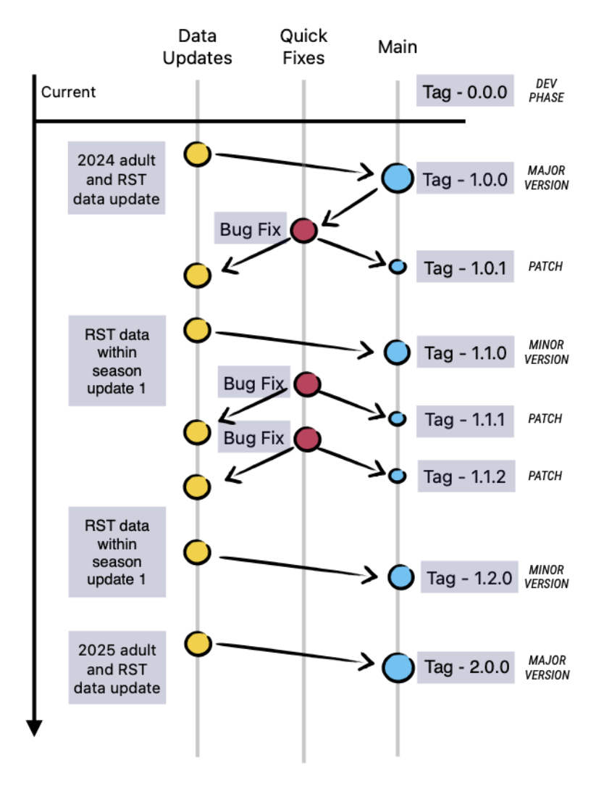

## **Data Versioning**

Use semantic versioning structure. See <https://semver.org/spec/v1.0.0.html> for more information.

Releases will follow the following number structure: X.Y.Z (Major.Minor.Patch)

- Major release indicates annual JPE data update (both Juv and adult) before running the JPE (will likely occur around December)

- Minor release indicates a within season RST data updates

- A patch is a fix to either of these types of updates if there is something funky with the data structure

{width="386"}

#### What needs to be done for each type of release (if running manually):

**Major:**

- Ensure all Juvenile and Adult data for the season is posted to EDI and in the SR JPE database

- Create a new branch off of main on SRJPEdata package

- Run update (data-raw/update-data.R script). Recommend running through line by line to catch any errors that may indicate a data issue.

- Update NEWS.md to describe data update

- Rebuild pkgdown site

- Create a PR into main

**Minor:**

- Ensure Juvenile updates for the within season is posted to EDI and in the SR JPE database

- Create new branch off of main on SRJPEdata package

- Run update (data-raw/update-data.R script). Recommend running through line by line to catch any errors that may indicate a data issue.

- Update news.md to describe data update

- Rebuild pkgdown site

- Create a PR into main

**Patch:**

- Create issue in SRJPEdata to discuss problems with data

- Create new branch off of main on SRJPEdata package

- Made code or data changes necessary to fix the issue

- If data changes - Run the update (data-raw/update-data.R script). Recommend running through line by line to catch any errors that may indicate a data issue.

- If code change, make sure you rewrite the fixed data object

- Update news.md to describe data update

- Rebuild pkgdown site

- Create a PR into main, close issue'

## Commit Messages

We follow [Conventional Commits](https://www.conventionalcommits.org/en/v1.0.0/). A consistent format makes the history easy to scan, lets us write `NEWS.md` from the log, and lets GitHub Actions tell what kind of release a commit belongs to.

### Format

```         
<type>(<scope>): <short summary>

<optional body: what changed and why>

<optional footer(s)>
```

- **Summary line**: 72 characters or fewer, imperative mood ("add", not "adds" or "added"), lowercase, no trailing period.
- **Body**: explain *why* the change was made and anything a data user should know, such as which years or sites changed. Wrap at 72 characters.
- **Footers**: `update-type:`, `BREAKING CHANGE:`, and issue links (`Closes #123`).

### Types

| Type | Use for | Example |
|------------------------|------------------------|------------------------|
| `feat` | A new data object, column, or capability | new `forecast_covariates` object |
| `fix` | Correcting wrong data or broken logic | Inf values dropping a year |
| `data` | Refreshing or updating data with no logic change | new RST pull, proofed temperature data |
| `qc` | QC checks, reports, or QC-driven corrections | Battle/Clear efficiency QC |
| `docs` | Vignettes, READMEs, NEWS, roxygen docs | sourcing documentation |
| `refactor` | Restructuring code without changing output | splitting a pull script |
| `chore` | Version bumps, release commits, housekeeping | bump to 1.1.0 |
| `ci` | GitHub Actions / workflow changes | pkgdown workflow |

### Scopes

The scope is optional but recommended. Use the **stream/site** or the **pipeline area** the change affects:

- Streams: `battle`, `butte`, `clear`, `deer`, `feather`, `mill`, `sacramento`, `yuba`
- Areas: `rst`, `adult`, `flow`, `temperature`, `survival`, `genetics`, `covariates`, `stock-recruit`, `pkgdown`
- Specific data objects also work: `rst_model_years`, `weekly_efficiency`

### Breaking changes

Any change that removes or renames a data object or column, or changes a column's meaning, will break downstream code (SRJPEmodel, SRJPEdashboard). Mark it with `!` after the type/scope **and** a `BREAKING CHANGE:` footer that tells users how to migrate.

### Release footer (`update-type`)

The commit that cuts a release (normally the PR merge into `main`) must include one of:

```         
update-type: annual     # major release; add manually
update-type: biweekly   # minor release; added automatically by GitHub Action
update-type: manual     # patch release; add manually 
```

`update-type` sets the version bump. Commit types (`feat`, `fix`, ...) describe what changed but do not bump the version on their own.

### Examples

**Bug fix**

```         
fix(flow): replace Inf from min/max before rolling means

min()/max() return Inf when every value in a window is NA. The Inf
then propagated into the rolling mean functions and dropped a year
from the output. Add safe_min()/safe_max() helpers that return NA
instead.
```

**New data object**

```         
feat(covariates): add forecast_covariates and stock_recruit_covariates

Builds both objects from the temperature and flow pulls so the
forecast and stock-recruit models share one covariate source.
```

**Data refresh from review**

```         
data(battle, clear): update redd and passage data from site review

Pulls proofed redd and passage data provided by the Battle/Clear
monitoring team. Adult years to exclude were updated to match.
```

**Breaking change**

```         
refactor(environmental)!: split environmental_data into flow and temperature

BREAKING CHANGE: `environmental_data` has been removed. Use
`flow_data` and `temperature_data` instead. Processing logic is
unchanged.
```

**Patch release**

```         
fix(rst_model_years): exclude years with fewer than 3 weeks of catch

- Adds Feather River (Herringer Riffle) 2026
- Removes Mill Creek 2025 (21 weeks sampled, 1 week with catch)

update-type: manual
Closes #290
```

**Annual release**

```         
chore(release): SRJPEdata 2.0.0 annual data update

RST data through the 2026/2027 season and adult estimates through 2026.
See NEWS.md for details.

update-type: annual
```

**Avoid** vague summaries like these:

```         
updates
fixes stuff
merges dev for merge conflicts
adds the excel needs to run the mill redd interpolation, combines the two methods...   # too long; put the details in the body
```
