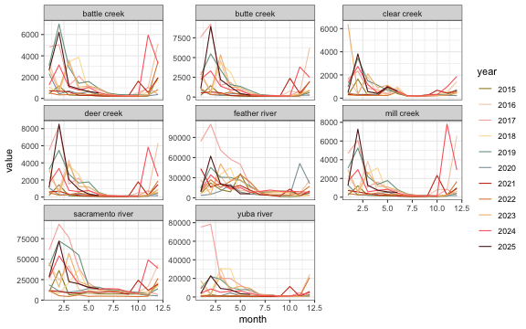

## Generate Yearling Rulesets 

Raw catch from the trap does not consistently differentiate between yearling and young of year (YOY) Chinook. FlowWest presented a proposed methodology at a life history diversity (LHD) ruleset workshop (see [lhd shiny](https://flowwest.shinyapps.io/lhd-workshop-shiny/) for workshop materials) and worked with watershed experts to define a methodology to systematically determine life history for each tributary (described below).

**Approach**

1) Set weekly cutoff values: Use visual determination on fork length over time scatter plots to set weekly cutoff values of yearlings vs YOY. 
2) Generate daily cutoff values: Use linear interpolation to extrapolate weekly cutoffs into daily values. 
3) Review & update: Share proposed cutoff values with watershed experts to review. Update as needed. 
4) Apply cutoff to catch data: Use daily cutoff values to generate a yearling column in the catch data. 

### Set Weekly Cutoff Values & Generate daily cutoff values

FlowWest proposed weekly cutoff values and used these weekly cutoff values to generate daily values using a linear approximation function, `approxfun`. 

`generate_cutoff <- approxfun(date, fork_length_cutoff, rule = 2)`

The plot below shows the updated cutoff values with linear interpolation of weekly cutoffs for Deer Creek. 

**Note: You can view all code used to generate plots and tables in this markdown [here.](https://github.com/SRJPE/SRJPEdata/blob/main/vignettes/lifestage_ruleset.Rmd)**


### Review & Update

FlowWest shared above plot for each watershed and asked stream experts to review. We incorporated feedback and modified rulesets to better separate yearlings and YOY. 

### Apply Cutoff to Catch Data

FlowWest took the daily cutoff line (shown in plot above) and used it as a threshold to classify yearling vs YOY in historical catch data. We added an `is_yearling` column to the catch data and set `is_yearling = TRUE` for any fish with a fork length that exceeded the yearling cutoff on a given date. 

The following code is applied in the `weekly_data_summary` script. 


```r
# Note this is not the final dataset as lifestage is added below
standard_catch_unmarked_w_yearling <- rst_catch |> 
  filter(species == "chinook") |>  # filter for only chinook
  mutate(month = month(date), 
         day = day(date)) |> 
  left_join(daily_yearling_ruleset) |> 
  mutate(is_yearling = case_when((fork_length <= cutoff & !run %in% c("fall","late fall", "winter")) ~ F,
                                 (fork_length > cutoff & !run %in% c("fall","late fall", "winter")) ~ T,
                                 (run %in% c("fall","late fall", "winter")) ~ NA,
                                 T ~ NA)) 
```


## Fry and Smolt Designations

In addition to differentiating between yearling and YOY it is important for the SR JPE to differentiate between fry and smolt as there will likely be a separate SR JPE for each lifestage. Some monitoring programs assign lifestage based on visual determination or fork length though not all RST data included lifestage data. To ensure lifestage was assigned consistently across streams and was complete, FlowWest developed an approach for differentiating between fry and smolt.

**Approach**

1. Create `lifestage` based on forklength cutoff of 45mm (< 45 - fry, > 45 - smolt)
2. Determine year specific proportions for fry, smolt, yearling for each stream, site, week and year
3. Determine general week proportions for fry, smolt, yearling for each stream, week
4. Apply proportions to data to fill in missing lifestage

### Create lifestage variable

The first step was to apply a lifestage cutoff to catch records that had fork lengths recorded. These cutoffs are `fork_length < 45 = fry`, `fork_length > 45 = smolt`, `fork_length > yearling_cutoff = yearling`.


|date       |stream       |site |subsite |site_group   | count|run       |life_stage |adipose_clipped |dead  | fork_length| weight|
|:----------|:------------|:----|:-------|:------------|-----:|:---------|:----------|:---------------|:-----|-----------:|------:|
|2003-11-04 |battle creek |ubc  |ubc     |battle creek |     1|late fall |yearling   |FALSE           |FALSE |         114|     NA|
|2003-11-25 |battle creek |ubc  |ubc     |battle creek |     1|spring    |fry        |FALSE           |FALSE |          33|     NA|
|2003-11-27 |battle creek |ubc  |ubc     |battle creek |     1|spring    |fry        |FALSE           |FALSE |          34|     NA|
|2003-11-29 |battle creek |ubc  |ubc     |battle creek |     1|spring    |fry        |FALSE           |FALSE |          36|     NA|
|2003-11-30 |battle creek |ubc  |ubc     |battle creek |     3|spring    |fry        |FALSE           |FALSE |          34|     NA|
|2003-11-30 |battle creek |ubc  |ubc     |battle creek |     1|spring    |fry        |FALSE           |FALSE |          35|     NA|
|2003-12-01 |battle creek |ubc  |ubc     |battle creek |     2|fall      |fry        |FALSE           |FALSE |          33|     NA|
|2003-12-01 |battle creek |ubc  |ubc     |battle creek |     1|spring    |fry        |FALSE           |FALSE |          34|     NA|
|2003-12-02 |battle creek |ubc  |ubc     |battle creek |     2|spring    |fry        |FALSE           |FALSE |          34|     NA|
|2003-12-02 |battle creek |ubc  |ubc     |battle creek |     1|spring    |fry        |FALSE           |FALSE |          34|     NA|

### Determine year specific lifestage proportions

There are 25964 entries with missing lifestage due to missing fork length data. 


|date       |stream       |site |subsite |site_group   | count|run    |life_stage |adipose_clipped |dead  | fork_length| weight|
|:----------|:------------|:----|:-------|:------------|-----:|:------|:----------|:---------------|:-----|-----------:|------:|
|2003-12-13 |battle creek |ubc  |ubc     |battle creek |     2|fall   |NA         |FALSE           |FALSE |          NA|     NA|
|2003-12-13 |battle creek |ubc  |ubc     |battle creek |     1|spring |NA         |FALSE           |FALSE |          NA|     NA|
|2003-12-14 |battle creek |ubc  |ubc     |battle creek |   125|fall   |NA         |FALSE           |FALSE |          NA|     NA|
|2003-12-14 |battle creek |ubc  |ubc     |battle creek |    28|spring |NA         |FALSE           |FALSE |          NA|     NA|
|2003-12-21 |battle creek |ubc  |ubc     |battle creek |   109|fall   |NA         |FALSE           |FALSE |          NA|     NA|
|2003-12-28 |battle creek |ubc  |ubc     |battle creek |    33|fall   |NA         |FALSE           |FALSE |          NA|     NA|

The first step in filling in these missing lifestages was to find the proportion for each lifestage category for a given stream, site, week, and year. This information could then be used to fill in the lifestage for missing rows within a week.


| year| week|stream     |site       | percent_fry| percent_smolt| percent_yearling|
|----:|----:|:----------|:----------|-----------:|-------------:|----------------:|
| 1992|   42|deer creek |deer creek |           0|             0|                1|
| 1992|   44|deer creek |deer creek |           0|             0|                1|
| 1992|   45|deer creek |deer creek |           0|             0|                1|
| 1992|   46|deer creek |deer creek |           0|             0|                1|
| 1992|   48|deer creek |deer creek |           0|             0|                1|
| 1992|   49|deer creek |deer creek |           0|             0|                1|
| 1994|   40|deer creek |deer creek |           0|             0|                1|
| 1994|   41|deer creek |deer creek |           0|             0|                1|
| 1994|   42|deer creek |deer creek |           0|             0|                1|
| 1994|   43|deer creek |deer creek |           0|             0|                1|

### Determine general weekly lifestage proportions

For weeks that had no fork length data in a given week, we calculated a general lifestage proportion across years. Calculating the proportion for each lifestage category for a given stream, site, and week. 


### Apply proportions to fill in missing values

We used these proportions to fill in missing lifestage values. See the final lifestage designations below. 


|date       |stream       |site |subsite |site_group   | count|run       |life_stage |adipose_clipped |dead  | fork_length| weight| week| year|model_lifestage_method   |
|:----------|:------------|:----|:-------|:------------|-----:|:---------|:----------|:---------------|:-----|-----------:|------:|----:|----:|:------------------------|
|2003-11-04 |battle creek |ubc  |ubc     |battle creek |     1|late fall |yearling   |FALSE           |FALSE |         114|     NA|   44| 2003|assigned from fl cutoffs |
|2003-11-25 |battle creek |ubc  |ubc     |battle creek |     1|spring    |fry        |FALSE           |FALSE |          33|     NA|   47| 2003|assigned from fl cutoffs |
|2003-11-27 |battle creek |ubc  |ubc     |battle creek |     1|spring    |fry        |FALSE           |FALSE |          34|     NA|   48| 2003|assigned from fl cutoffs |
|2003-11-29 |battle creek |ubc  |ubc     |battle creek |     1|spring    |fry        |FALSE           |FALSE |          36|     NA|   48| 2003|assigned from fl cutoffs |
|2003-11-30 |battle creek |ubc  |ubc     |battle creek |     3|spring    |fry        |FALSE           |FALSE |          34|     NA|   48| 2003|assigned from fl cutoffs |
|2003-11-30 |battle creek |ubc  |ubc     |battle creek |     1|spring    |fry        |FALSE           |FALSE |          35|     NA|   48| 2003|assigned from fl cutoffs |
|2003-12-01 |battle creek |ubc  |ubc     |battle creek |     2|fall      |fry        |FALSE           |FALSE |          33|     NA|   48| 2003|assigned from fl cutoffs |
|2003-12-01 |battle creek |ubc  |ubc     |battle creek |     1|spring    |fry        |FALSE           |FALSE |          34|     NA|   48| 2003|assigned from fl cutoffs |
|2003-12-02 |battle creek |ubc  |ubc     |battle creek |     2|spring    |fry        |FALSE           |FALSE |          34|     NA|   48| 2003|assigned from fl cutoffs |
|2003-12-02 |battle creek |ubc  |ubc     |battle creek |     1|spring    |fry        |FALSE           |FALSE |          34|     NA|   48| 2003|assigned from fl cutoffs |

### Review lifestage

The following plot shows the general patten in the lifestage field where fry are caught earlier in the year and smolt are caught later in the year.

**Battle Creek: 2011**



## Save resulting data to package


