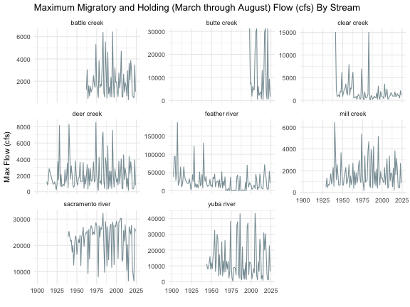
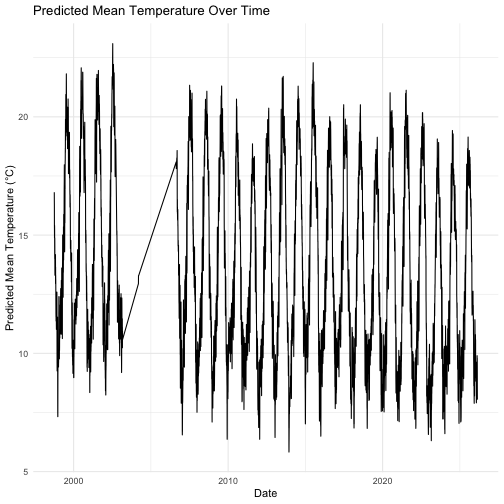
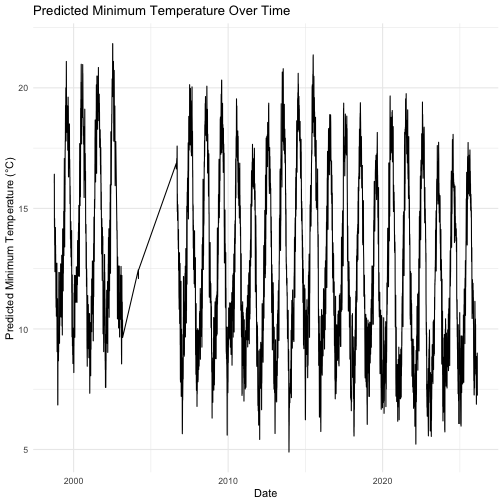
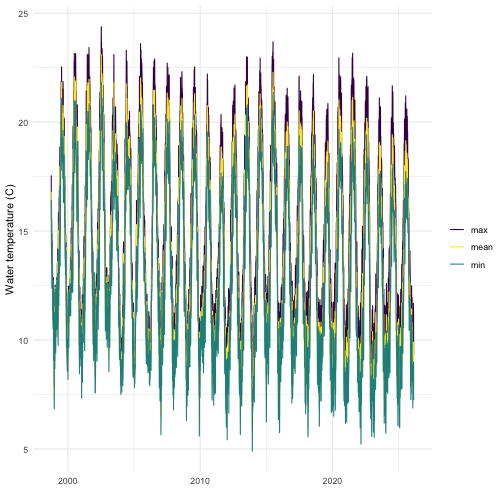

There are multiple covariates used in SR JPE modeling that were developed through separate but related processes. There are currently two documents describing covariate selction and processing for different models: (1) Stock Recruit Covariates and (2) Adult Model Covariates (this document).

The Passage to Spawner (P2S) model relates spawner counts (from redd or holding surveys) to upstream passage counts obtained by video systems. This model is restricted to streams with reliable redd or holding surveys and reliable upstream passage counts. It is also restricted to years where the redd/holding and upstream passage datasets overlap. This vignette describes the process of pulling and processing environmental covariates for use in the P2S model.

## Selecting Adult Environmental Covariates

Potential environmental covariates hypothesized to influence prespawn mortality were proposed in meetings with the SR JPE Modeling Advisory Team (MAT). Five initial categories were identified: 

* temperature
* flow
* water year type
* passage timing
* total passage

There are many ways to summarize each of these categories and initial analyses helped identify collinearity and performance of each potential method by regressing prespawn mortality (calculated as `upstream_count / spawner_count`) against the environmental variable. When we were using redd counts as `spawner_count`, our model assumed a 50/50 sex ratio and modified that equation to be `upstream_count / (spawner_count * 0.5)`. Generally, one redd per female is a reasonable assumption although our model left the possibility open for more than one redd per female [(source)](https://www.researchgate.net/publication/233231658_The_Number_of_Redds_Constructed_per_Female_Spring_Chinook_Salmon_in_the_Wenatchee_River_Basin). Note that this covariate analysis and preparation does not include the Sacramento River mainstem as spring run do not spawn on the mainstem Sacramento.

## Preparing Covariates {.tabset}

### Temperature 

Several approaches were considered for summarizing temperature: 

1. Proportion of days where the temperature surpassed a threshold of 20 degrees Celsius [(source)](https://www.noaa.gov/sites/default/files/legacy/document/2020/Oct/07354626766.pdf) 
2. Growing degree days (GDD) with a base temperature of 0 degrees Celsius [(source)](https://www.researchgate.net/publication/279930331_Fish_growth_and_degree-days_I_Selecting_a_base_temperature_for_a_within-population_study and input from MAT team)  
3. Degree Day 20 (DD20), where cumulative degree days are calculated against a threshold of 20 degrees Celsius [(source)](https://journals.plos.org/plosone/article?id=10.1371/journal.pone.0204274) 

Following initial analyses and discussions, we focused on approach 3 because it showed the most consistent relationship with prespawn mortality across streams and accounts for cumulative stress. We calculated the metric for migration months (March - May) in the Sacramento River and holding months (May - August) in each tributary. The resulting dataset is as follows (note that DD less than 0 are set to 0):

<table>
 <thead>
  <tr>
   <th style="text-align:right;"> year </th>
   <th style="text-align:left;"> stream </th>
   <th style="text-align:right;"> gdd_trib </th>
   <th style="text-align:right;"> gdd_sac </th>
   <th style="text-align:right;"> gdd_total </th>
  </tr>
 </thead>
<tbody>
  <tr>
   <td style="text-align:right;"> 1999 </td>
   <td style="text-align:left;"> deer creek </td>
   <td style="text-align:right;"> 79.30787 </td>
   <td style="text-align:right;"> 0 </td>
   <td style="text-align:right;"> 79.31 </td>
  </tr>
  <tr>
   <td style="text-align:right;"> 1999 </td>
   <td style="text-align:left;"> mill creek </td>
   <td style="text-align:right;"> 24.35044 </td>
   <td style="text-align:right;"> 0 </td>
   <td style="text-align:right;"> 24.35 </td>
  </tr>
  <tr>
   <td style="text-align:right;"> 2000 </td>
   <td style="text-align:left;"> butte creek </td>
   <td style="text-align:right;"> 38.89352 </td>
   <td style="text-align:right;"> 0 </td>
   <td style="text-align:right;"> 38.89 </td>
  </tr>
  <tr>
   <td style="text-align:right;"> 2000 </td>
   <td style="text-align:left;"> deer creek </td>
   <td style="text-align:right;"> 191.70059 </td>
   <td style="text-align:right;"> 0 </td>
   <td style="text-align:right;"> 191.70 </td>
  </tr>
  <tr>
   <td style="text-align:right;"> 2000 </td>
   <td style="text-align:left;"> feather river </td>
   <td style="text-align:right;"> 41.54767 </td>
   <td style="text-align:right;"> 0 </td>
   <td style="text-align:right;"> 41.55 </td>
  </tr>
  <tr>
   <td style="text-align:right;"> 2000 </td>
   <td style="text-align:left;"> mill creek </td>
   <td style="text-align:right;"> 97.26157 </td>
   <td style="text-align:right;"> 0 </td>
   <td style="text-align:right;"> 97.26 </td>
  </tr>
  <tr>
   <td style="text-align:right;"> 2000 </td>
   <td style="text-align:left;"> yuba river </td>
   <td style="text-align:right;"> 424.80334 </td>
   <td style="text-align:right;"> 0 </td>
   <td style="text-align:right;"> 424.80 </td>
  </tr>
  <tr>
   <td style="text-align:right;"> 2001 </td>
   <td style="text-align:left;"> butte creek </td>
   <td style="text-align:right;"> 70.30324 </td>
   <td style="text-align:right;"> 0 </td>
   <td style="text-align:right;"> 70.30 </td>
  </tr>
  <tr>
   <td style="text-align:right;"> 2001 </td>
   <td style="text-align:left;"> clear creek </td>
   <td style="text-align:right;"> 17.07813 </td>
   <td style="text-align:right;"> 0 </td>
   <td style="text-align:right;"> 17.08 </td>
  </tr>
  <tr>
   <td style="text-align:right;"> 2001 </td>
   <td style="text-align:left;"> deer creek </td>
   <td style="text-align:right;"> 282.67653 </td>
   <td style="text-align:right;"> 0 </td>
   <td style="text-align:right;"> 282.68 </td>
  </tr>
</tbody>
</table>

The following plot is of the growing degree days above the 20 degree threshold over time for all tributaries:

### Flow 

Maximum flow more effectively captures the high flow events that support migration speed and passage to upstream holding areas. Additionally, upon inspection of the data source across multiple years average maximum flow over the migratory and holding months (March-May and May-August, respectively) was more representative of the fluctuations in flow over the entire year. The resulting dataset is as follows:

<table>
 <thead>
  <tr>
   <th style="text-align:left;"> stream </th>
   <th style="text-align:right;"> year </th>
   <th style="text-align:right;"> mean_flow </th>
   <th style="text-align:right;"> max_flow </th>
  </tr>
 </thead>
<tbody>
  <tr>
   <td style="text-align:left;"> battle creek </td>
   <td style="text-align:right;"> 1962 </td>
   <td style="text-align:right;"> 381.2174 </td>
   <td style="text-align:right;"> 1230 </td>
  </tr>
  <tr>
   <td style="text-align:left;"> battle creek </td>
   <td style="text-align:right;"> 1963 </td>
   <td style="text-align:right;"> 546.4620 </td>
   <td style="text-align:right;"> 3030 </td>
  </tr>
  <tr>
   <td style="text-align:left;"> battle creek </td>
   <td style="text-align:right;"> 1964 </td>
   <td style="text-align:right;"> 299.2228 </td>
   <td style="text-align:right;"> 442 </td>
  </tr>
  <tr>
   <td style="text-align:left;"> battle creek </td>
   <td style="text-align:right;"> 1965 </td>
   <td style="text-align:right;"> 531.6793 </td>
   <td style="text-align:right;"> 1590 </td>
  </tr>
  <tr>
   <td style="text-align:left;"> battle creek </td>
   <td style="text-align:right;"> 1966 </td>
   <td style="text-align:right;"> 354.5272 </td>
   <td style="text-align:right;"> 664 </td>
  </tr>
  <tr>
   <td style="text-align:left;"> battle creek </td>
   <td style="text-align:right;"> 1967 </td>
   <td style="text-align:right;"> 638.0163 </td>
   <td style="text-align:right;"> 1530 </td>
  </tr>
  <tr>
   <td style="text-align:left;"> battle creek </td>
   <td style="text-align:right;"> 1968 </td>
   <td style="text-align:right;"> 379.7011 </td>
   <td style="text-align:right;"> 1030 </td>
  </tr>
  <tr>
   <td style="text-align:left;"> battle creek </td>
   <td style="text-align:right;"> 1969 </td>
   <td style="text-align:right;"> 666.6467 </td>
   <td style="text-align:right;"> 1270 </td>
  </tr>
  <tr>
   <td style="text-align:left;"> battle creek </td>
   <td style="text-align:right;"> 1970 </td>
   <td style="text-align:right;"> 541.0217 </td>
   <td style="text-align:right;"> 1510 </td>
  </tr>
  <tr>
   <td style="text-align:left;"> battle creek </td>
   <td style="text-align:right;"> 1971 </td>
   <td style="text-align:right;"> 585.0380 </td>
   <td style="text-align:right;"> 2500 </td>
  </tr>
</tbody>
</table>

The following plot is of max flow (cfs) over time for all tributaries:

### Water Year Type

To account for the influence of large scale interannual climate variability, we investigated water year type as a covariate as described by the [California Department of Water Resources](https://cdec.water.ca.gov/reportapp/javareports?name=WSIHIST) and available in the [waterYearType package in R](https://cloud.r-project.org/web/packages/waterYearType/index.html). 

We used the `waterYearType` package to pull water year assignments as a categorical covariate. Some streams had very few data points (i.e. for Mill Creek, only seven years were considered dependable), so we simplified all potential categories of water year type into either dry (`Dry`, `Below Normal`, `Critical`) or wet (`Wet`, `Above Normal`). The table below summarizes the number of dry and wet years that were included:

<table>
 <thead>
  <tr>
   <th style="text-align:left;"> Water Year Type </th>
   <th style="text-align:right;"> Count </th>
  </tr>
 </thead>
<tbody>
  <tr>
   <td style="text-align:left;"> dry </td>
   <td style="text-align:right;"> 63 </td>
  </tr>
  <tr>
   <td style="text-align:left;"> wet </td>
   <td style="text-align:right;"> 53 </td>
  </tr>
</tbody>
</table>

### Passage Timing

Passage timing was considered; however, limited data reduced the sample size of the datasets for some tributaries so much as to remove them from candidacy for the model due to lack of statistical power. Passage timing was summarized as the mean, median, and min day of passage. The resulting dataset is as follows:

<table>
 <thead>
  <tr>
   <th style="text-align:right;"> year </th>
   <th style="text-align:left;"> stream </th>
   <th style="text-align:right;"> median_passage_timing </th>
   <th style="text-align:right;"> mean_passage_timing </th>
   <th style="text-align:right;"> min_passage_timing </th>
  </tr>
 </thead>
<tbody>
  <tr>
   <td style="text-align:right;"> 1998 </td>
   <td style="text-align:left;"> battle creek </td>
   <td style="text-align:right;"> 23.5 </td>
   <td style="text-align:right;"> 24.03333 </td>
   <td style="text-align:right;"> 22 </td>
  </tr>
  <tr>
   <td style="text-align:right;"> 1999 </td>
   <td style="text-align:left;"> battle creek </td>
   <td style="text-align:right;"> 25.0 </td>
   <td style="text-align:right;"> 24.58824 </td>
   <td style="text-align:right;"> 21 </td>
  </tr>
  <tr>
   <td style="text-align:right;"> 2000 </td>
   <td style="text-align:left;"> battle creek </td>
   <td style="text-align:right;"> 28.0 </td>
   <td style="text-align:right;"> 28.48684 </td>
   <td style="text-align:right;"> 21 </td>
  </tr>
  <tr>
   <td style="text-align:right;"> 2001 </td>
   <td style="text-align:left;"> battle creek </td>
   <td style="text-align:right;"> 21.5 </td>
   <td style="text-align:right;"> 23.33784 </td>
   <td style="text-align:right;"> 19 </td>
  </tr>
  <tr>
   <td style="text-align:right;"> 2002 </td>
   <td style="text-align:left;"> battle creek </td>
   <td style="text-align:right;"> 27.0 </td>
   <td style="text-align:right;"> 27.90909 </td>
   <td style="text-align:right;"> 21 </td>
  </tr>
  <tr>
   <td style="text-align:right;"> 2003 </td>
   <td style="text-align:left;"> battle creek </td>
   <td style="text-align:right;"> 33.0 </td>
   <td style="text-align:right;"> 32.00000 </td>
   <td style="text-align:right;"> 25 </td>
  </tr>
  <tr>
   <td style="text-align:right;"> 2004 </td>
   <td style="text-align:left;"> battle creek </td>
   <td style="text-align:right;"> 24.0 </td>
   <td style="text-align:right;"> 24.34783 </td>
   <td style="text-align:right;"> 22 </td>
  </tr>
  <tr>
   <td style="text-align:right;"> 2005 </td>
   <td style="text-align:left;"> battle creek </td>
   <td style="text-align:right;"> 24.0 </td>
   <td style="text-align:right;"> 24.81395 </td>
   <td style="text-align:right;"> 21 </td>
  </tr>
  <tr>
   <td style="text-align:right;"> 2006 </td>
   <td style="text-align:left;"> battle creek </td>
   <td style="text-align:right;"> 25.5 </td>
   <td style="text-align:right;"> 25.77500 </td>
   <td style="text-align:right;"> 24 </td>
  </tr>
  <tr>
   <td style="text-align:right;"> 2007 </td>
   <td style="text-align:left;"> battle creek </td>
   <td style="text-align:right;"> 22.0 </td>
   <td style="text-align:right;"> 22.95187 </td>
   <td style="text-align:right;"> 19 </td>
  </tr>
</tbody>
</table>

The following plot is of median passage over time for all tributaries:

### Total Passage as Index

We hypothesized that total annual passage might be an indicator of density because more adults in holding/spawning habitat could result in less available habitat and thus influence prespawn mortality. 

<table>
 <thead>
  <tr>
   <th style="text-align:right;"> year </th>
   <th style="text-align:left;"> stream </th>
   <th style="text-align:right;"> passage_index </th>
  </tr>
 </thead>
<tbody>
  <tr>
   <td style="text-align:right;"> 1995 </td>
   <td style="text-align:left;"> battle creek </td>
   <td style="text-align:right;"> 66 </td>
  </tr>
  <tr>
   <td style="text-align:right;"> 1995 </td>
   <td style="text-align:left;"> clear creek </td>
   <td style="text-align:right;"> 2 </td>
  </tr>
  <tr>
   <td style="text-align:right;"> 1996 </td>
   <td style="text-align:left;"> battle creek </td>
   <td style="text-align:right;"> 35 </td>
  </tr>
  <tr>
   <td style="text-align:right;"> 1997 </td>
   <td style="text-align:left;"> battle creek </td>
   <td style="text-align:right;"> 107 </td>
  </tr>
  <tr>
   <td style="text-align:right;"> 1998 </td>
   <td style="text-align:left;"> battle creek </td>
   <td style="text-align:right;"> 178 </td>
  </tr>
  <tr>
   <td style="text-align:right;"> 1998 </td>
   <td style="text-align:left;"> clear creek </td>
   <td style="text-align:right;"> 47 </td>
  </tr>
  <tr>
   <td style="text-align:right;"> 1999 </td>
   <td style="text-align:left;"> battle creek </td>
   <td style="text-align:right;"> 73 </td>
  </tr>
  <tr>
   <td style="text-align:right;"> 1999 </td>
   <td style="text-align:left;"> clear creek </td>
   <td style="text-align:right;"> 35 </td>
  </tr>
  <tr>
   <td style="text-align:right;"> 2000 </td>
   <td style="text-align:left;"> battle creek </td>
   <td style="text-align:right;"> 78 </td>
  </tr>
  <tr>
   <td style="text-align:right;"> 2000 </td>
   <td style="text-align:left;"> clear creek </td>
   <td style="text-align:right;"> 9 </td>
  </tr>
</tbody>
</table>

### Combine and Save Covariate Data 

Both continuous environmental variables (flow and temperature) were standardized and centered within streams before performing any analyses so that the scale of the data did not affect results. Water year type was coded as a binary variable as `1` for wet (wet, above normal) and `0` for dry (below normal, dry, critical). The resulting dataset is as follows (note that flow data has the longest time series available):

<table>
 <thead>
  <tr>
   <th style="text-align:right;"> year </th>
   <th style="text-align:left;"> stream </th>
   <th style="text-align:right;"> wy_type </th>
   <th style="text-align:right;"> max_flow_std </th>
   <th style="text-align:right;"> gdd_std </th>
   <th style="text-align:right;"> passage_index </th>
   <th style="text-align:right;"> median_passage_timing_std </th>
  </tr>
 </thead>
<tbody>
  <tr>
   <td style="text-align:right;"> 1962 </td>
   <td style="text-align:left;"> battle creek </td>
   <td style="text-align:right;"> 0 </td>
   <td style="text-align:right;"> -0.5103739 </td>
   <td style="text-align:right;"> NA </td>
   <td style="text-align:right;"> NA </td>
   <td style="text-align:right;"> NA </td>
  </tr>
  <tr>
   <td style="text-align:right;"> 1963 </td>
   <td style="text-align:left;"> battle creek </td>
   <td style="text-align:right;"> 1 </td>
   <td style="text-align:right;"> 0.6857655 </td>
   <td style="text-align:right;"> NA </td>
   <td style="text-align:right;"> NA </td>
   <td style="text-align:right;"> NA </td>
  </tr>
  <tr>
   <td style="text-align:right;"> 1964 </td>
   <td style="text-align:left;"> battle creek </td>
   <td style="text-align:right;"> 0 </td>
   <td style="text-align:right;"> -1.0340171 </td>
   <td style="text-align:right;"> NA </td>
   <td style="text-align:right;"> NA </td>
   <td style="text-align:right;"> NA </td>
  </tr>
  <tr>
   <td style="text-align:right;"> 1965 </td>
   <td style="text-align:left;"> battle creek </td>
   <td style="text-align:right;"> 1 </td>
   <td style="text-align:right;"> -0.2711460 </td>
   <td style="text-align:right;"> NA </td>
   <td style="text-align:right;"> NA </td>
   <td style="text-align:right;"> NA </td>
  </tr>
  <tr>
   <td style="text-align:right;"> 1966 </td>
   <td style="text-align:left;"> battle creek </td>
   <td style="text-align:right;"> 0 </td>
   <td style="text-align:right;"> -0.8864933 </td>
   <td style="text-align:right;"> NA </td>
   <td style="text-align:right;"> NA </td>
   <td style="text-align:right;"> NA </td>
  </tr>
  <tr>
   <td style="text-align:right;"> 1967 </td>
   <td style="text-align:left;"> battle creek </td>
   <td style="text-align:right;"> 1 </td>
   <td style="text-align:right;"> -0.3110173 </td>
   <td style="text-align:right;"> NA </td>
   <td style="text-align:right;"> NA </td>
   <td style="text-align:right;"> NA </td>
  </tr>
  <tr>
   <td style="text-align:right;"> 1968 </td>
   <td style="text-align:left;"> battle creek </td>
   <td style="text-align:right;"> 0 </td>
   <td style="text-align:right;"> -0.6432783 </td>
   <td style="text-align:right;"> NA </td>
   <td style="text-align:right;"> NA </td>
   <td style="text-align:right;"> NA </td>
  </tr>
  <tr>
   <td style="text-align:right;"> 1969 </td>
   <td style="text-align:left;"> battle creek </td>
   <td style="text-align:right;"> 1 </td>
   <td style="text-align:right;"> -0.4837930 </td>
   <td style="text-align:right;"> NA </td>
   <td style="text-align:right;"> NA </td>
   <td style="text-align:right;"> NA </td>
  </tr>
  <tr>
   <td style="text-align:right;"> 1970 </td>
   <td style="text-align:left;"> battle creek </td>
   <td style="text-align:right;"> 1 </td>
   <td style="text-align:right;"> -0.3243078 </td>
   <td style="text-align:right;"> NA </td>
   <td style="text-align:right;"> NA </td>
   <td style="text-align:right;"> NA </td>
  </tr>
  <tr>
   <td style="text-align:right;"> 1971 </td>
   <td style="text-align:left;"> battle creek </td>
   <td style="text-align:right;"> 1 </td>
   <td style="text-align:right;"> 0.3335689 </td>
   <td style="text-align:right;"> NA </td>
   <td style="text-align:right;"> NA </td>
   <td style="text-align:right;"> NA </td>
  </tr>
</tbody>
</table>

The following plot is of standardized covariates (covariates are colored by type) over time for all tributaries:

#### Save data object
Data object saved in `SRJPEdata` as `p2s_model_covariates_standard.rds`. To access documentation search `?SRJPEdata::p2s_model_covariates_standard.rds`.

