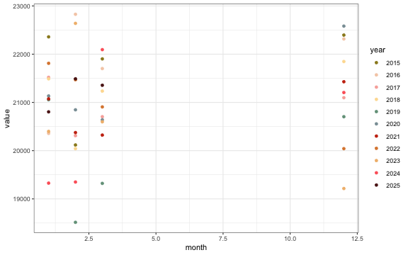
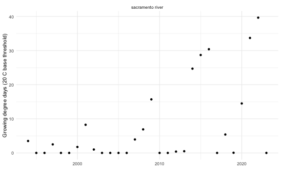

The Passage to Spawner (P2S) model relates spawner counts (from redd or holding surveys) to upstream passage counts obtained by video systems. This model is restricted to streams with reliable redd or holding surveys and reliable upstream passage counts. It is also restricted to years where the redd/holding and upstream passage datasets overlap. This vignette describes the process of pulling and processing environmental covariates for use in the P2S model.

Potential environmental covariates hypothesized to influence prespawn mortality were proposed in meetings with the SRJPE Modeling Advisory Team (MAT). Five initial categories were identified: 

* temperature, 
* flow, 
* passage timing, 
* water year type, 
* and total passage. 

There are many ways to summarize each of these categories and initial analyses helped identify collinearity and performance of each potential method by regressing prespawn mortality (calculated as `upstream_count / spawner_count`) against the environmental variable. When we were using redd counts as `spawner_count`, our model assumed a 50/50 sex ratio and modified that equation to be `upstream_count / (spawner_count * 0.5)`. Generally, one redd per female is a reasonable assumption although our model left the possibility open for more than one redd per female [(source)](https://www.researchgate.net/publication/233231658_The_Number_of_Redds_Constructed_per_Female_Spring_Chinook_Salmon_in_the_Wenatchee_River_Basin).

## Format environmental variables {.tabset}

### Temperature 

Several approaches were considered for summarizing temperature: 

1. Proportion of days where the temperature surpassed a threshold of 20 degrees Celsius [(source)](https://www.noaa.gov/sites/default/files/legacy/document/2020/Oct/07354626766.pdf) 
2. Growing degree days (GDD) with a base temperature of 0 degrees Celsius [(source)](https://www.researchgate.net/publication/279930331_Fish_growth_and_degree-days_I_Selecting_a_base_temperature_for_a_within-population_study and input from MAT team)  
3. Degree Day 20 (DD20), where cumulative degree days are calculated against a threshold of 20 degrees Celsius [(source)](https://journals.plos.org/plosone/article?id=10.1371/journal.pone.0204274) 

Following initial analyses and discussions, we focused on approach 3 because it showed the most consistent relationship with prespawn mortality across streams and accounts for cumulative stress. We calculated the metric for migration months (March - May) in the Sacramento River and holding months (May - August) in each tributary. 

| year|stream        |  gdd_trib| gdd_sac| gdd_total|
|----:|:-------------|---------:|-------:|---------:|
| 1999|deer creek    |  79.30787|       0|     79.31|
| 1999|mill creek    |  24.35044|       0|     24.35|
| 2000|butte creek   |  38.89352|       0|     38.89|
| 2000|deer creek    | 191.70059|       0|    191.70|
| 2000|feather river |  47.67365|       0|     47.67|
| 2000|mill creek    |  97.26157|       0|     97.26|
| 2000|yuba river    | 430.34858|       0|    430.35|
| 2001|butte creek   |  70.30324|       0|     70.30|
| 2001|clear creek   |  17.07813|       0|     17.08|
| 2001|deer creek    | 282.67653|       0|    282.68|

### Flow 

Maximum flow more effectively captures the high flow events that support migration speed and passage to upstream holding areas. Additionally, upon inspection of the data source across multiple years average maximum flow over the migratory and holding months (March-May and May-August, respectively) was more representative of the fluctuations in flow over the entire year.

|stream       | year| mean_flow| max_flow|
|:------------|----:|---------:|--------:|
|battle creek | 1962|  381.2174|     1230|
|battle creek | 1963|  546.4620|     3030|
|battle creek | 1964|  299.2228|      442|
|battle creek | 1965|  531.6793|     1590|
|battle creek | 1966|  354.5272|      664|
|battle creek | 1967|  638.0163|     1530|
|battle creek | 1968|  379.7011|     1030|
|battle creek | 1969|  666.6467|     1270|
|battle creek | 1970|  541.0217|     1510|
|battle creek | 1971|  585.0380|     2500|

### Passage Timing

Passage timing was considered; however, limited data reduced the sample size of the datasets for some tributaries so much as to remove them from candidacy for the model due to lack of statistical power.

| year|stream       | median_passage_timing| mean_passage_timing| min_passage_timing|
|----:|:------------|---------------------:|-------------------:|------------------:|
| 1998|battle creek |                  23.5|            24.03333|                 22|
| 1999|battle creek |                  25.0|            24.58824|                 21|
| 2000|battle creek |                  28.0|            28.48684|                 21|
| 2001|battle creek |                  21.5|            23.33784|                 19|
| 2002|battle creek |                  27.0|            27.90909|                 21|
| 2003|battle creek |                  33.0|            32.00000|                 25|
| 2004|battle creek |                  24.0|            24.34783|                 22|
| 2005|battle creek |                  24.0|            24.81395|                 21|
| 2006|battle creek |                  25.5|            25.77500|                 24|
| 2007|battle creek |                  22.0|            22.95187|                 19|

### Water Year Type

To account for the influence of large scale interannual climate variability, we investigated water year type as a covariate as described by the [California Department of Water Resources](https://cdec.water.ca.gov/reportapp/javareports?name=WSIHIST) and available in the [waterYearType package in R](https://cloud.r-project.org/web/packages/waterYearType/index.html). 

We used the `waterYearType` package to pull water year assignments as a categorical covariate. Because for some streams we had very few data points (i.e. for Mill Creek, only seven years were considered dependable), we simplified all potential categories of water year type into either dry (`Dry`, `Below Normal`, `Critical`) or wet (`Wet`, `Above Normal`).

|Water Year Type | Count|
|:---------------|-----:|
|dry             |    60|
|wet             |    52|

### Total Passage as Index

We hypothesized that total annual passage might be an indicator of density because more adults in holding/spawning habitat could result in less available habitat and thus influence prespawn mortality.

| year|stream       | passage_index|
|----:|:------------|-------------:|
| 1995|battle creek |            66|
| 1995|clear creek  |             2|
| 1996|battle creek |            35|
| 1997|battle creek |           107|
| 1998|battle creek |           178|
| 1998|clear creek  |            47|
| 1999|battle creek |            73|
| 1999|clear creek  |            35|
| 2000|battle creek |            78|
| 2000|clear creek  |             9|

## Combine and standardize

Both continuous environmental variables (flow and temperature) were standardized and centered within streams before performing any analyses so that the scale of the data did not affect results. Water year type was coded as a binary variable as `1` for wet (wet, above normal) and `0` for dry (below normal, dry, critical).

| year|stream       | wy_type| max_flow_std| gdd_std| passage_index| median_passage_timing_std|
|----:|:------------|-------:|------------:|-------:|-------------:|-------------------------:|
| 1962|battle creek |       0|   -0.5100941|      NA|            NA|                        NA|
| 1963|battle creek |       1|    0.6858838|      NA|            NA|                        NA|
| 1964|battle creek |       0|   -1.0336666|      NA|            NA|                        NA|
| 1965|battle creek |       1|   -0.2708985|      NA|            NA|                        NA|
| 1966|battle creek |       0|   -0.8861627|      NA|            NA|                        NA|
| 1967|battle creek |       1|   -0.3107644|      NA|            NA|                        NA|
| 1968|battle creek |       0|   -0.6429805|      NA|            NA|                        NA|
| 1969|battle creek |       1|   -0.4835168|      NA|            NA|                        NA|
| 1970|battle creek |       1|   -0.3240531|      NA|            NA|                        NA|
| 1971|battle creek |       1|    0.3337348|      NA|            NA|                        NA|

#### Save data object
Data object saved in `SRJPEdata` as `p2s_model_covariates_standard.rds`. To access documentation search `?SRJPEdata::p2s_model_covariates_standard.rds`.

