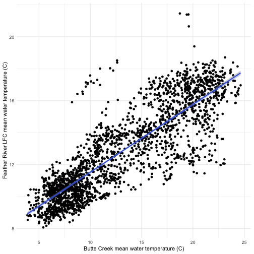
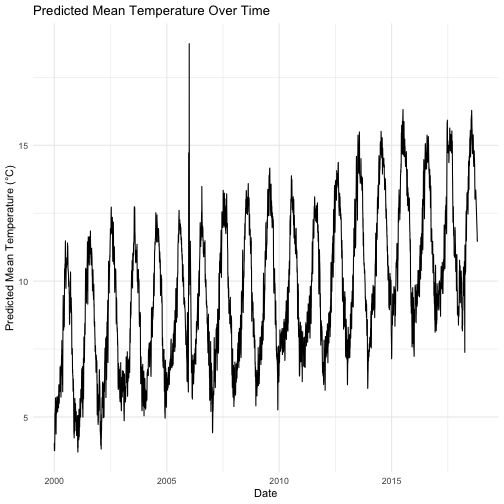
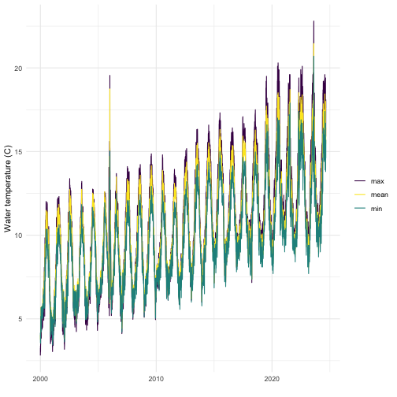
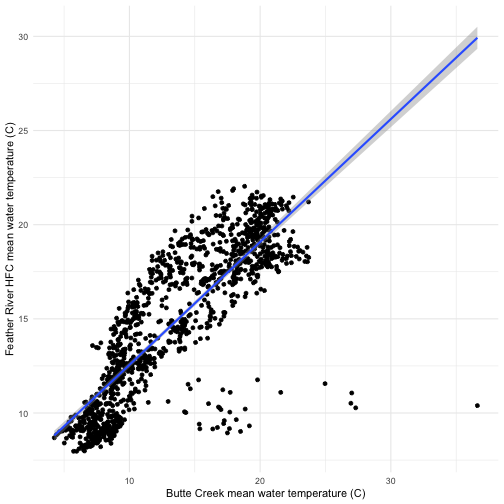
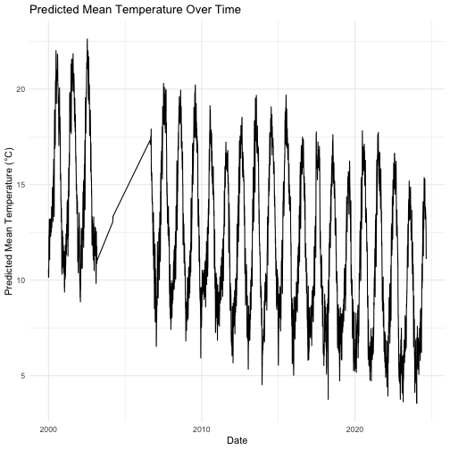
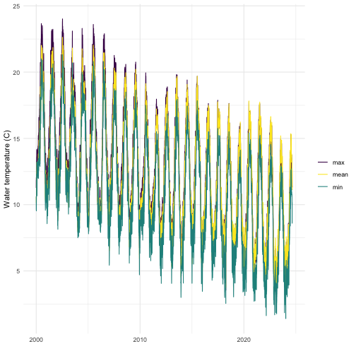
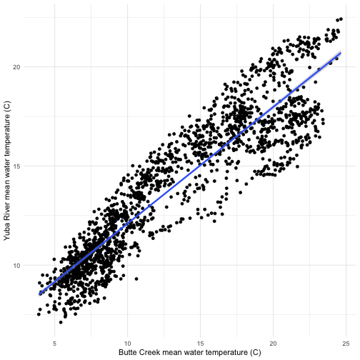
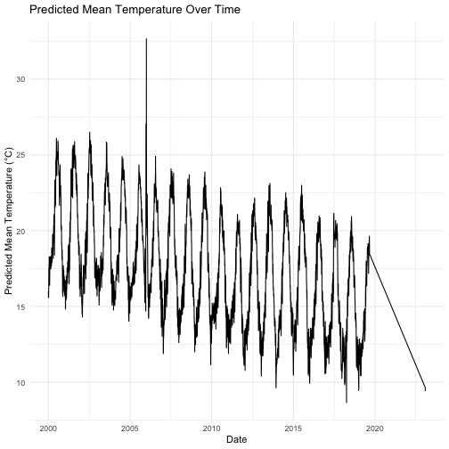
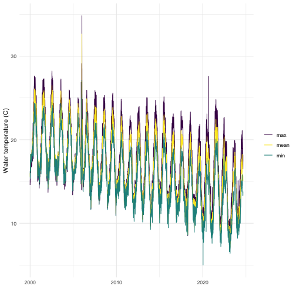

# Regression Analysis for Water Temperature Data

The goal of this analysis is to fill in data gaps where temperature data are missing or the time series is incomplete in order to make the dataset more useful for SR JPE modeling. Temperature is an important covariate in understanding juvenile production though the completeness of these data vary by location.

Currently this analysis relies on a regression model and is performed for the Feather River and Yuba River. The resulting dataset with predicted values is saved and integrated in the development of a water temperature dataset.

## Data used to build models: Butte Creek

Butte Creek is used to build the regression models because the time series is complete and the data are high quality.

  * Date range covered in the Butte Creek temperature data is 1999 - 2024
  
## Overall approach for water temperature regression:

1. Prepare datasets for regression analysis (dataset with no missing data is used to train the model and dataset with missing data are predicted using the model)

2. Fit and evaluate linear regression models for mean, min, and max temperatures 

3. Make predictions for missing data using the fitted models

4. Combine predictions with actual measurements

5. Visualize the predicted and actual temperature over time to asses model performance trends


## Feather River

### Data Preparation and Approach

1. Pull in gage data from CDEC (GRL will represent the High Flow Channel (HFC) and FRA will represent the Low Flow Channel (LFC))
* GRL (2003-03-05 to 2007-06-01 H; 2020-01-04 to present): located after Thermalito Afterbay
* FRA (2002-01-01 to present): located between Lake Oroville and Thermalito Afterbay

2. Prepare datasets for regression analysis
* Dataset with no missing data to train and test the model (Butte Creek and Feather River)
* Dataset with missing data to make predictions (Feather River)

3. Use data where there are no missing data from either dataset for regression modeling

4. Use the regression model to make predictions from the testing dataset and evaluate

5. Use the model to make predictions for missing data
 


### Low Flow Channel (LFC)


#### Exploratory analysis

Before we developed any models, we explored the relationship between water temperature at each location. There is a linear correlation between mean, min, and max water temperature on Butte Creek and Feather River LFC. For example, the plot below suggests a strong linear relationship between the mean water temperatures of Butte Creek and Feather River LFC. The positive slope of the linear trend line implies that higher water temperatures in Butte Creek are associated with higher water temperatures in Feather River LFC. These visual representations support the results of the linear regression analysis, which identified a statistically significant relationship between the mean, max and min water temperatures of these two locations.

*Plot of mean temp for Feather River LFC and Butte Creek*



#### Building regression models

We built 3 regression models for Feather River LFC - one each for mean, min, and max water temperature relationships. We evaluated the models using the Mean Absolute Percentage Error (MAPE). The MAPE for all three models indicated good predictive accuracy.

- MAPE for the mean model: 0.08488823, which means the model's predictions are off by about 8.49% on average. 
- MAPE for the min model: 0.08800298, which means the model's predictions are off by about 8.80% on average. 
- MAPE for the max model: 0.07784735, which means the model's predictions are off by about 7.78% on average. 


```
## 
## Call:
## lm(formula = temp ~ date + butte_temp, data = train)
## 
## Residuals:
##     Min      1Q  Median      3Q     Max 
## -4.9187 -0.8415  0.0404  0.8070  5.8940 
## 
## Coefficients:
##               Estimate Std. Error t value Pr(>|t|)    
## (Intercept) -5.5234509  0.9932186  -5.561  3.1e-08 ***
## date         0.0006822  0.0000527  12.945  < 2e-16 ***
## butte_temp   0.4177119  0.0059345  70.387  < 2e-16 ***
## ---
## Signif. codes:  0 '***' 0.001 '**' 0.01 '*' 0.05 '.' 0.1 ' ' 1
## 
## Residual standard error: 1.352 on 1716 degrees of freedom
##   (1 observation deleted due to missingness)
## Multiple R-squared:  0.7548,	Adjusted R-squared:  0.7545 
## F-statistic:  2641 on 2 and 1716 DF,  p-value: < 2.2e-16
```

```
## [1] 0.08014766
```


```
## 
## Call:
## lm(formula = temp ~ date + butte_temp, data = train)
## 
## Residuals:
##     Min      1Q  Median      3Q     Max 
## -4.7386 -0.7994  0.0571  0.7666  6.1257 
## 
## Coefficients:
##               Estimate Std. Error t value Pr(>|t|)    
## (Intercept) -4.728e+00  9.754e-01  -4.847 1.37e-06 ***
## date         6.397e-04  5.181e-05  12.346  < 2e-16 ***
## butte_temp   3.928e-01  6.338e-03  61.971  < 2e-16 ***
## ---
## Signif. codes:  0 '***' 0.001 '**' 0.01 '*' 0.05 '.' 0.1 ' ' 1
## 
## Residual standard error: 1.326 on 1716 degrees of freedom
##   (1 observation deleted due to missingness)
## Multiple R-squared:  0.7075,	Adjusted R-squared:  0.7072 
## F-statistic:  2076 on 2 and 1716 DF,  p-value: < 2.2e-16
```

```
## [1] 0.08615113
```
  

```
## 
## Call:
## lm(formula = temp ~ date + butte_temp, data = train)
## 
## Residuals:
##     Min      1Q  Median      3Q     Max 
## -5.2053 -0.7685  0.0305  0.8275  6.0524 
## 
## Coefficients:
##               Estimate Std. Error t value Pr(>|t|)    
## (Intercept) -8.389e+00  1.035e+00  -8.108 9.68e-16 ***
## date         8.306e-04  5.494e-05  15.119  < 2e-16 ***
## butte_temp   4.376e-01  5.577e-03  78.460  < 2e-16 ***
## ---
## Signif. codes:  0 '***' 0.001 '**' 0.01 '*' 0.05 '.' 0.1 ' ' 1
## 
## Residual standard error: 1.414 on 1717 degrees of freedom
## Multiple R-squared:  0.7942,	Adjusted R-squared:  0.794 
## F-statistic:  3313 on 2 and 1717 DF,  p-value: < 2.2e-16
```

```
## [1] NA
```

#### Predictions

  * Combine predictions (mean, min, max data frames into one)
  * Reshape data

The plot shows the predicted mean temperature of the Feather River LFC over time (which is similar for min and max predictions as well). The line represents the trend of the predicted mean temperatures, indicating how they change as the date progresses. This visualization helps to identify any patterns or trends in the mean water temperature over the observed period.




#### Full dataset

  * Join with original data (merge combined predictions with the original dataset that includes gage agency and gage number)
  * Visualize combined data
  
The plot below shows how the mean, min, and max temperatures for the Feather River LFC over time. Interpolated values are seamlessly integrated where observed data is missing, ensuring a continuous temperature dataset. Each water temperature type (mean, min, max) is represented with a different color to help in distinguishing the temperature trends and understanding the temperature fluctuations.


```
## Rows: 26,934
## Columns: 7
## Groups: stream, date, statistic, gage_agency, gage_number, site_group [26,934]
## $ date        <date> 1999-12-31, 1999-12-31, 1999-12-31, 2000-01-01, 2000-01-01, 2000-01-01, 2000-01-02, 2000-01-02, 2000-01-02, 2000-01-03, 2000-01-03, 2000-01-03, 2000-01-04, 2000-01-04, 2000-01-04, 2000-01-05, 2000-01-05, 2000-01-05, 2000-…
## $ stream      <chr> "feather river", "feather river", "feather river", "feather river", "feather river", "feather river", "feather river", "feather river", "feather river", "feather river", "feather river", "feather river", "feather river", "…
## $ site_group  <chr> "upper feather lfc", "upper feather lfc", "upper feather lfc", "upper feather lfc", "upper feather lfc", "upper feather lfc", "upper feather lfc", "upper feather lfc", "upper feather lfc", "upper feather lfc", "upper feath…
## $ gage_agency <chr> "interpolated", "interpolated", "interpolated", "interpolated", "interpolated", "interpolated", "interpolated", "interpolated", "interpolated", "interpolated", "interpolated", "interpolated", "interpolated", "interpolated"…
## $ gage_number <chr> "interpolated", "interpolated", "interpolated", "interpolated", "interpolated", "interpolated", "interpolated", "interpolated", "interpolated", "interpolated", "interpolated", "interpolated", "interpolated", "interpolated"…
## $ statistic   <chr> "mean", "max", "min", "mean", "max", "min", "mean", "max", "min", "mean", "max", "min", "mean", "max", "min", "mean", "max", "min", "mean", "max", "min", "mean", "max", "min", "mean", "max", "min", "mean", "max", "min", "m…
## $ value       <dbl> 3.955524, 2.810967, 4.165934, 4.025825, 3.249380, 3.970199, 3.758475, 2.943903, 3.578088, 3.889693, 3.207283, 3.657278, 4.012207, 3.383147, 3.932843, 3.819698, 3.208944, 3.619282, 3.766425, 3.034742, 3.541372, 3.958559, 3.…
```




### HFC


#### Exploratory analysis

There is a linear correlation between mean, min, and max water temperature on Butte Creek and Feather River HFC. For example, the plot below suggests a strong linear relationship between the mean water temperatures of Butte Creek and Feather River HFC. The positive slope of the linear trend line implies that higher water temperatures in Butte Creek are associated with higher water temperatures in Feather River HFC. These visual representations support the results of the linear regression analysis, which identified a statistically significant relationship between the mean, max and min water temperatures of these two locations.

*Plot of mean temp for Feather River HFC and Butte Creek*



#### Building regression models

We built 3 regression models for Feather River HFC - one each for mean, min, and max water temperature relationships. We evaluated the models using the Mean Absolute Percentage Error (MAPE). The MAPE for all three models indicated good predictive accuracy.

- MAPE for the mean model: 0.1252, which means the model's predictions are off by about 12.52% on average. 
- MAPE for the min model: 0.0973, which means the model's predictions are off by about 9.73% on average. 
- MAPE for the max model: 0.1364, which means the model's predictions are off by about 13.64% on average. 


#### Predictions

  * Combine predictions (mean, min, max data frames into one)
  * Reshape data

The plot shows the predicted mean temperature of the Feather River HFC over time (which is similar for min and max predictions as well). The line represents the trend of the predicted mean temperatures, indicating how they change as the date progresses. This visualization helps to identify any patterns or trends in the mean water temperature over the observed period.




#### Full dataset

  * Join with original data (merge combined predictions with the original dataset that includes gage agency and gage number)
  * Visualize combined data
  
The plot below shows how the mean, min, and max temperatures for the Feather River HFC over time. Interpolated values are seamlessly integrated where observed data is missing, ensuring a continuous temperature dataset. Each water temperature type (mean, min, max) is represented with a different color to help in distinguishing the temperature trends and understanding the temperature fluctuations.


```
## Rows: 26,970
## Columns: 7
## Groups: stream, date, statistic, gage_agency, gage_number, site_group [26,970]
## $ date        <date> 1999-12-31, 1999-12-31, 1999-12-31, 2000-01-01, 2000-01-01, 2000-01-01, 2000-01-02, 2000-01-02, 2000-01-02, 2000-01-03, 2000-01-03, 2000-01-03, 2000-01-04, 2000-01-04, 2000-01-04, 2000-01-05, 2000-01-05, 2000-01-05, 2000-…
## $ stream      <chr> "feather river", "feather river", "feather river", "feather river", "feather river", "feather river", "feather river", "feather river", "feather river", "feather river", "feather river", "feather river", "feather river", "…
## $ site_group  <chr> "upper feather hfc", "upper feather hfc", "upper feather hfc", "upper feather hfc", "upper feather hfc", "upper feather hfc", "upper feather hfc", "upper feather hfc", "upper feather hfc", "upper feather hfc", "upper feath…
## $ gage_agency <chr> "interpolated", "interpolated", "interpolated", "interpolated", "interpolated", "interpolated", "interpolated", "interpolated", "interpolated", "interpolated", "interpolated", "interpolated", "interpolated", "interpolated"…
## $ gage_number <chr> "interpolated", "interpolated", "interpolated", "interpolated", "interpolated", "interpolated", "interpolated", "interpolated", "interpolated", "interpolated", "interpolated", "interpolated", "interpolated", "interpolated"…
## $ statistic   <chr> "mean", "max", "min", "mean", "max", "min", "mean", "max", "min", "mean", "max", "min", "mean", "max", "min", "mean", "max", "min", "mean", "max", "min", "mean", "max", "min", "mean", "max", "min", "mean", "max", "min", "m…
## $ value       <dbl> 10.462976, 11.266007, 10.622723, 10.572151, 11.872001, 10.281526, 10.148245, 11.446254, 9.600068, 10.353593, 11.809485, 9.735238, 10.545203, 12.051335, 10.210668, 10.239454, 11.807659, 9.665315, 10.153532, 11.563984, 9.528…
```




## Yuba River

### Data Prepartion and Approach

1. Pull in gage data from YR7 CDEC gage.

* Note that this gage only contains data from 2020 onwards. Originally we included temperature data collected during RST data collection for this analysis; however, due to inconsistencies in using two different data sources the resulting predicted mean values were lower than the min values as the RST data only has mean data. We then decided to just rely on the gage data despite the small time period.

2. Prepare datasets for regression analysis
* Dataset with no missing data to train (Butte Creek and Yuba River)
* Dataset with missing data to predict (Yuba River)

3. Combine datasets with no missing data, and missing data

4. Identify gaps to predict

5. Use data where there are no missing data for either dataset for regression modeling


#### Exploratory analysis

There is a linear correlation between mean, min, and max water temperature on Butte Creek and Yuba River. For example, the plot below suggests a strong linear relationship between the mean water temperatures of Butte Creek and Yuba River. The positive slope of the linear trend line implies that higher water temperatures in Butte Creek are associated with higher water temperatures in Yuba River. These visual representations support the results of the linear regression analysis, which identified a statistically significant relationship between the mean, max and min water temperatures of these two locations.

*Plot of mean temp for Yuba River and Butte Creek*



#### Building regression models

We built 3 regression models for Yuba River - one each for mean, min, and max water temperature relationships. We evaluated the models using the Mean Absolute Percentage Error (MAPE). The MAPE for all three models indicated good predictive accuracy.

- MAPE for the mean model: 0.0844, which means the model's predictions are off by about 8.44% on average. 
- MAPE for the min model: 0.0838, which means the model's predictions are off by about 8.38% on average. 
- MAPE for the max model: 0.078, which means the model's predictions are off by about 7.80% on average. 


  

  


#### Predictions

  * Combine predictions (mean, min, max data frames into one)
  * Reshape data

The plot shows the predicted mean temperature of the Yuba River over time (which is similar for min and max predictions as well). The line represents the trend of the predicted mean temperatures, indicating how they change as the date progresses. This visualization helps to identify any patterns or trends in the mean water temperature over the observed period.




#### Full dataset

  * Join with original data (merge combined predictions with the original dataset that includes gage agency and gage number)
  * Visualize combined data
  
The plot below shows how the mean, min, and max temperatures for the Yuba River over time. Interpolated values are seamlessly integrated where observed data is missing, ensuring a continuous temperature dataset. Each water temperature type (mean, min, max) is represented with a different color to help in distinguishing the temperature trends and understanding the temperature fluctuations.
  

```
## Rows: 26,934
## Columns: 6
## Groups: stream, date, statistic, gage_agency, gage_number [26,934]
## $ date        <date> 1999-12-31, 1999-12-31, 1999-12-31, 2000-01-01, 2000-01-01, 2000-01-01, 2000-01-02, 2000-01-02, 2000-01-02, 2000-01-03, 2000-01-03, 2000-01-03, 2000-01-04, 2000-01-04, 2000-01-04, 2000-01-05, 2000-01-05, 2000-01-05, 2000-…
## $ stream      <chr> "yuba river", "yuba river", "yuba river", "yuba river", "yuba river", "yuba river", "yuba river", "yuba river", "yuba river", "yuba river", "yuba river", "yuba river", "yuba river", "yuba river", "yuba river", "yuba river"…
## $ gage_agency <chr> "interpolated", "interpolated", "interpolated", "interpolated", "interpolated", "interpolated", "interpolated", "interpolated", "interpolated", "interpolated", "interpolated", "interpolated", "interpolated", "interpolated"…
## $ gage_number <chr> "interpolated", "interpolated", "interpolated", "interpolated", "interpolated", "interpolated", "interpolated", "interpolated", "interpolated", "interpolated", "interpolated", "interpolated", "interpolated", "interpolated"…
## $ statistic   <chr> "mean", "max", "min", "mean", "max", "min", "mean", "max", "min", "mean", "max", "min", "mean", "max", "min", "mean", "max", "min", "mean", "max", "min", "mean", "max", "min", "mean", "max", "min", "mean", "max", "min", "m…
## $ value       <dbl> 15.86137, 14.57515, 16.23317, 15.95818, 15.21088, 15.96407, 15.58137, 14.76476, 15.42679, 15.76363, 15.14594, 15.53313, 15.93368, 15.39984, 15.90764, 15.66184, 15.14464, 15.47764, 15.58532, 14.88943, 15.36944, 15.85302, 15…
```




