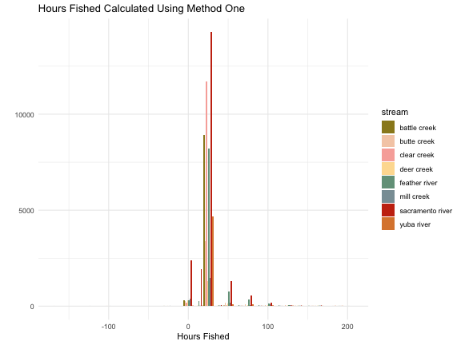
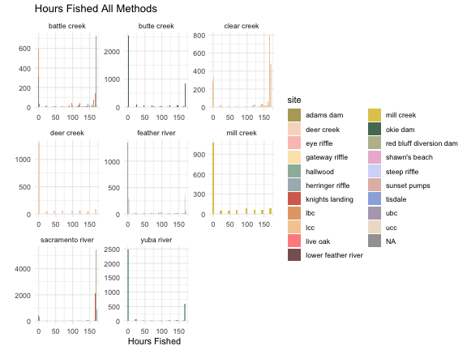

In order to estimate juvenile abundance (see the BTSPASX in the SRJPEmodel package) from catch data collected at rotary screw traps we need to know how efficient the traps are (what percent of the population is captured in the traps?) and the amount of time the trap is sampling. Hours fished is a calculated field. The goal of this document is to calculate hours fished by date, stream and site.

Data were checked and cleaned in scripts available [here](https://github.com/FlowWest/JPE-datasets/tree/main/scripts/rst).
Cleaned data were saved on the JPE cloud database and pulled using the `pull_tables_from_database.R` script. 

## Methods

We explored three primary methods to calculate hours fished. Methods were chosen based on data collected at the RST site. When no times, trap revolutions, or trap revolutions per minute (RPMs) were collected, we assume 24 hours for each day that trap is fishing. The trap revolution method is commonly used by RST programs but we were not able to get reasonable results for most programs we tried it on so we ended up relying on trap times instead of revolutions. This may be due to different methods for determining cone rotation rate. For instance, Battle measures the average time per rotation whereas Feather River and Knights Landing measure the revolutions per minute. Using total revolutions and the cone rotation rate to calculate sampling period may be useful in the future when methods are more similar.  

1) Use start and stop time
2) Use RPMs start, RPMs end, and total revolutions (Method 2 was used as a comparison method but was ultimately not picked as the final method)
3) Use start time only 

Below is the code for each of the methods described above: 

1) If the start and stop date/time of the sampling period are available, simply subtract the difference in time.


```r
# calculating hours fished when have start and stop datetime
hours_fished <- function(dat){
  dat %>%
    filter(!is.na(trap_stop_time), !is.na(trap_start_time)) %>%
    mutate(start_datetime = ymd_hms(paste(trap_start_date, trap_start_time)),
           stop_datetime = ymd_hms(paste(trap_stop_date, trap_stop_time)),
           hours_fished = round(difftime(stop_datetime, start_datetime, units = "hours"), 2))
}
```

2) If the RPMs start, RPMs end, and total revolutions are available, 
take the average cone RPMs and divide `total_revolutions`/average RMP/60 to get total hours fished.


```r
# calculating hours fished when have start and stop datetime
revolution_calculated_hours_fished <- function(dat){
  dat %>%
    filter(!is.na(rpm_start) | !is.na(rpm_end), !is.na(total_revolutions)) %>% 
    mutate(prior_day_rpm = ifelse(is.na(rpm_end), NA, lag(rpm_end)),
           sum_rpms = ifelse(is.na(prior_day_rpm), rpm_start, rpm_start + prior_day_rpm), 
           cone_rpms = sum_rpms / 2,
           hours_fished = case_when(is.na(rpm_start) ~ round(total_revolutions/rpm_end/60, 2),
                                    is.na(rpm_end) ~ round(total_revolutions/rpm_start/60, 2), 
                                    TRUE ~ round(total_revolutions/cone_rpms/60, 2)))
}
```

3) If only one date is available, assume that the end date is the date sampled on the following day.


```r
# calculating hours fished when have only date and time
hours_fished_one_date <- function(dat) {
  dat %>%
  arrange(site, subsite, start_datetime) %>%
  mutate(end_datetime = lead(start_datetime),
         end_datetime = case_when(difftime(end_datetime, start_datetime, units = "hours") > 120 ~ start_datetime + hours(24), 
                                  T ~ end_datetime),
         hours_fished = round(difftime(end_datetime, start_datetime, units = "hours"), 2))
}
```

### Other Assumptions

Based on protocols and information from monitoring programs, sampling periods are typically 24 hours,
unless flows are very high in which traps are checked more frequently. Calculating hours fished based
on time and date provided in data provides more specificity, however, there are typos and errors resulting
in nonsensical hours fished. In these cases, we assume 24 hour sampling periods. 

- If only a date is available and no time, assume 24 hour sampling periods for each date.
- If information is missing or there are typos, assume 24 hour sampling periods.

## Hours Fished {.tabset}

## Method 1: Battle Creek, Clear Creek, Feather River, Knights Landing, Tisdale

The above creeks have data available to calculate the hours fished. There are a few
cases when start date is NA. For these we fill in the start date assuming
it is the sample date of the previous record. Note that there are some records with 0 hours.
These occur because trap visit data was entered when the trap was not in service and
then a new trap visit entry was recorded once the trap started working again.


|start_datetime      |stop_datetime       |site       |subsite          |stream        |hours_fished_methodology       |hours_fished |
|:-------------------|:-------------------|:----------|:----------------|:-------------|:------------------------------|:------------|
|1997-12-22 10:40:00 |1997-12-22 10:40:00 |eye riffle |eye riffle_north |feather river |using start time and stop time |0.00 hours   |
|1997-12-22 10:40:00 |1997-12-23 11:40:00 |eye riffle |eye riffle_north |feather river |using start time and stop time |25.00 hours  |
|1997-12-26 13:56:00 |1997-12-26 13:56:00 |eye riffle |eye riffle_north |feather river |using start time and stop time |0.00 hours   |
|1997-12-26 13:56:00 |1997-12-27 09:56:00 |eye riffle |eye riffle_north |feather river |using start time and stop time |20.00 hours  |
|1997-12-27 09:56:00 |1997-12-28 09:11:00 |eye riffle |eye riffle_north |feather river |using start time and stop time |23.25 hours  |

### QC

The dot plot below shows hours fished for each stream by date. Most dots appear to be hovering around the 24 hour mark but a few are greater than 1000 or less than -1000 and skew the plot. 


The histogram below shows data filtered to remove the outliers though there are still some inconsistencies with hours fished below or equal to 0. As mentioned above there are reasons why hours fished may be 0.


## Method 3: Butte Creek & Yuba River

Hours fished are calculated by taking the difference between the date/time at each 
observation. 


|start_datetime      |end_datetime        |site      |subsite   |stream      |hours_fished_methodology | hours_fished|
|:-------------------|:-------------------|:---------|:---------|:-----------|:------------------------|------------:|
|1997-01-18 09:00:00 |1997-01-19 09:00:00 |adams dam |adams dam |butte creek |using only start time    |        24.00|
|1997-03-05 09:00:00 |1997-03-06 09:00:00 |adams dam |adams dam |butte creek |using only start time    |        24.00|
|1997-03-11 07:00:00 |1997-03-12 09:15:00 |adams dam |adams dam |butte creek |using only start time    |        26.25|
|1997-03-12 09:15:00 |1997-03-15 09:00:00 |adams dam |adams dam |butte creek |using only start time    |        71.75|
|1997-03-15 09:00:00 |1997-03-16 09:30:00 |adams dam |adams dam |butte creek |using only start time    |        24.50|

### QC

The dot plot below shows hours fished for each stream by date. Here we see several distinct bands of dots in  24 hour increments, indicating that the trap is most often checked every day but that there are some instances where it is checked every other or every few days. 



Anything greater than 5 days of trap operation was considered a mistake and set at 24 hours instead. The histogram below shows data filtered to remove the outliers though we still see some inconsistencies with hours fished below or equal to 0. 


## Mill Creek & Deer Creek

Mill & Deer creeks do not have data available (no time variable) to calculate hours fished.
Mill & Deer creeks also do not have sample period revolutions so we cannot use trap revolutions 
fished. We therefore assume 24 hours fished for every day with data. 


|trap_stop_date |stream     |site       |subsite    |site_group |hours_fished_methodology | hours_fished|
|:--------------|:----------|:----------|:----------|:----------|:------------------------|------------:|
|1992-10-14     |deer creek |deer creek |deer creek |deer creek |24 hour assumption       |           24|
|1992-10-17     |deer creek |deer creek |deer creek |deer creek |24 hour assumption       |           24|
|1992-10-30     |deer creek |deer creek |deer creek |deer creek |24 hour assumption       |           24|
|1992-11-04     |deer creek |deer creek |deer creek |deer creek |24 hour assumption       |           24|
|1992-11-05     |deer creek |deer creek |deer creek |deer creek |24 hour assumption       |           24|


# Combine Data

We combined all methods to create one table with daily hours fished for each trap. We added rows with 0 effort for days that where there is no trapping data. 


## Summarized by week

We grouped hours fished data by site, subsite, week, and year and summarized to come up with a weekly hours fished dataset. We capped hours fished to 168 for each stream, assuming that a single trap could not run for more hours than there are in a week. Before 2005 trap data is not available for Knights Landing, we assume 168 hours when trap data is missing.  


```
## # A tibble: 243 × 5
## # Groups:   year, stream, site [41]
##     year stream           site                    subsite     n
##    <int> <chr>            <chr>                   <chr>   <int>
##  1  1994 sacramento river red bluff diversion dam gate 1      5
##  2  1994 sacramento river red bluff diversion dam gate 10     4
##  3  1994 sacramento river red bluff diversion dam gate 11     6
##  4  1994 sacramento river red bluff diversion dam gate 3     12
##  5  1994 sacramento river red bluff diversion dam gate 5     16
##  6  1994 sacramento river red bluff diversion dam gate 7     11
##  7  1994 sacramento river red bluff diversion dam gate 9     16
##  8  1995 sacramento river knights landing         8.3         3
##  9  1995 sacramento river knights landing         8.4         7
## 10  1995 sacramento river red bluff diversion dam gate 1     33
## # ℹ 233 more rows
```

### QC

The following plots provide visuals to show weekly hours fished for all tributaries. Note that this is for all years of data so there are multiple datapoints for a given week due to multiple years being represented.


