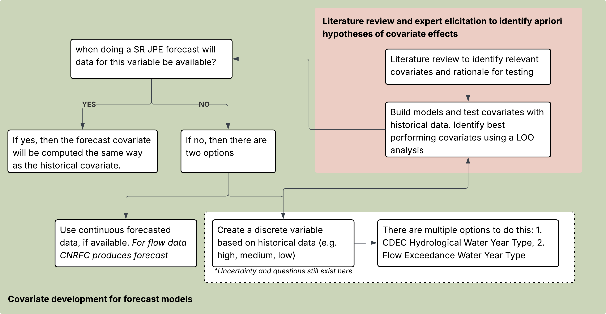

```{r, include = FALSE}
knitr::opts_chunk$set(
  collapse = TRUE,
  warning = FALSE,
  message = FALSE,
  echo = FALSE,
  comment = "#>",
  fig.width = 8, fig.height = 5)

library(SRJPEdata)
library(tidyverse)
library(kableExtra)
library(ggplot2)
library(dplyr)
library(knitr)

colors_full <-  c("#9A8822", "#F5CDB4", "#F8AFA8", "#FDDDA0", "#74A089", #Royal 2
                  "#899DA4", "#C93312", "#DC863B", # royal 1 (- 3)
                  "#F1BB7B", "#FD6467", "#5B1A18", # Grand Budapest 1 (-4)
                  "#D8B70A", "#02401B", "#A2A475", # Cavalcanti 1
                  "#E6A0C4", "#C6CDF7", "#D8A499", "#7294D4", #Grand Budapest 2
                  "#9986A5", "#EAD3BF", "#AA9486", "#B6854D", "#798E87" # Isle of dogs 2 altered slightly
)

cov_definitions <- read_csv(here::here("data-raw", "helper-tables", "covariate_definitions.csv"))
cov_selections <- read_csv(here::here("data-raw", "helper-tables", "covariate_selection_table.csv"))
```

There are multiple covariates used in SR JPE modeling that were developed through separate but related processes. This vignette provides a comprehensive summary of:

1. All covariates that were explored across model types
2. Covariate selection process
3. Forecast covariates consideration 
4. The current covariates selected for each model

The code that generates these covariates lives in `data-raw/process_data_scripts/build_covariates.R`; this vignette describes the covariates and considerations in the covariate selection process. 

## 1 Covariate Summary Table

The following table lists the covariates tested within the SRJPEmodels. 

```{r covariate-summary-table}
covariate_summary <- cov_selections

covariate_summary |>
  kable(escape = FALSE, align = c("l","l","l","c","c","c","c","c","l")) |>
  kable_classic(full_width = TRUE, font_size = 12) |>
  column_spec(1, bold = FALSE) |>
  column_spec(4:8, width = "1.8cm") |>
  row_spec(which(str_detect(covariate_summary$`Stock-Recruit`, "Selected") |
                   str_detect(covariate_summary$`P2S`, "Selected") |
                   str_detect(covariate_summary$Survival, "Selected") |
                   str_detect(covariate_summary$`Juv. Abundance`, "Selected")),
           bold = TRUE, background = "#f0f7ee") 
```

*Rows highlighted in green indicate covariates that are selected in at least one final model. "Tested" indicates the covariate was explored but not selected as the primary covariate. "—" indicates the covariate was not applicable to that model type.*

---

## Covariates Explored By Type

### Temperature Covariates

Temperature covariates were developed for the spawning/incubation period (Aug–Dec in tributaries) and the adult migration period (Mar–May in the Sacramento River mainstem). All temperature data come from USGS, CDEC, and USFWS gages; gaps are filled with rolling 3-day means or monthly means.

```{r temp-cov-table}
temp_cov_detail <- cov_definitions |> 
  filter(Type == "temperature") 

temp_cov_detail |>
  kable(escape = FALSE) |>
  kable_classic(full_width = TRUE, font_size = 12) 
```

### Flow Covariates

Flow covariates were developed for the spawning/incubation period (Aug–Dec) and the juvenile rearing period (Nov–Jul for tributaries; Jan–Jul for the Sacramento River). Daily maximum flows are used to capture peak flow conditions. All data come from USGS and CDEC gages.

```{r flow-cov-table}
flow_cov_detail <- cov_definitions |> 
  filter(Type == "flow") 

flow_cov_detail |>
  kable(escape = FALSE) |>
  kable_classic(full_width = TRUE, font_size = 12) 
```

### Categorical Covariates


```{r cat-cov-table}
cat_cov_detail <- cov_definitions |> 
  filter(Type == "water year summary") 

cat_cov_detail |>
  kable(escape = FALSE) |>
  kable_classic(full_width = TRUE, font_size = 12) 
```

### Reservoir Storage Covariates

Reservoir storage in Shasta and Keswick Reservoirs integrates upstream water management and provides an early-season indicator of downstream flow conditions. These data are particularly useful for forecasting because they are reported in real time.

```{r res-cov-table}
res_cov_detail <- cov_definitions |> 
  filter(Type == "resevoir storage") 

res_cov_detail |>
  kable(escape = FALSE) |>
  kable_classic(full_width = TRUE, font_size = 12) 
```

## 2 How Covariates Were Selected

### Literature Review and Expert Elicitation

Covariate selection began with a literature review and input from the SR JPE Modeling Advisory Team (MAT). The goal was to identify environmental drivers expected to influence spring run Chinook salmon survival, growth, and reproductive success based on known biological mechanisms. The candidate covariate list and supporting literature can be found in the [FlowWest covariate planning spreadsheet](https://docs.google.com/spreadsheets/d/1Q4VUBE72KdPq0x65y_vUoDMj5dDHp8XwOyDNIyIJKpE/edit#gid=0).

Key ecological relationships motivating covariate selection:

- **Temperature** influences adult spawning success, egg incubation timing, emergence date, juvenile growth rates, and adult migration mortality. The 13°C threshold for spawning/incubation thermal stress and 20°C threshold for adult migration thermal stress are grounded in peer-reviewed literature (NOAA 2018; [Kaylor et al. 2022](https://esajournals.onlinelibrary.wiley.com/doi/full/10.1002/ecs2.4160)).
- **Flow** drives habitat availability, upstream passage success, juvenile rearing conditions, and trap efficiency. Both spawning-period and rearing-period flows are expected to affect brood-year productivity.
- **Water year type** integrates large-scale interannual climate variability and provides a useful categorical proxy when continuous data are unavailable.

### Testing with Leave-One-Out (LOO) Analysis

Candidate covariates were tested within -----TODO confirm which models actually use LOO --- each model using leave-one-out (LOO) cross-validation. LOO analysis holds out one brood year at a time and evaluates how well the model predicts that year using the remaining data. This approach was used to:

1. Identify covariates that improve predictive accuracy over a null (no-covariate) model
2. Compare performance across candidate covariates within the same model
3. Identify covariates that are robust across streams and years

## 3 Forecast Covariates

A key design decision in the SR JPE model system is whether to use covariates derived from **historical observations** or adapted for **forecast and scenario applications**. Many of the strongest-performing covariates in historical stock-recruit modeling — such as rearing-period maximum flow (Nov–Jul) — are **not available at the time of forecasting** because the rearing season has not yet concluded. An annual JPE forecast must be produced early in the calendar year (e.g., January), before the rearing season ends in July.The diagram outlines the process for developing proposed covariates for forecast and scenario models. 

As we transition to forecast and scenario model application, we need to find out if the data for a given covariate will be available at the time of forecasting. If yes, the covariate will be included in the forecast model using the same structure as the historical covariate. If the answer is no, meaning the covariate data will not be available during the forecaste period, then two strategies are considered:

  1. Use continuous forecast data, if available
  
  2. Create a discrete covariate based on historical data: restructure and bin the variable into categories based on historical conditions (e.g. high, medium, low)

{width="108%"}

### Why is Forecasting Important

The SR JPE is intended to provide an **operational forecast** of annual spring run Chinook juvenile production before the outmigration season is complete. The modeling team therefore favors covariates that:

1. **Are available at the time of forecasting** — either from prior-year observations (spawning-period covariates are fully observed before the January forecast) or from real-time data (reservoir storage, early-season flows)
2. **Support scenario planning** — categorical water year type covariates allow users to run the model under hypothetical future conditions (e.g., "what if this is a dry year?")

## 4 Selected Covariate Summary Table
