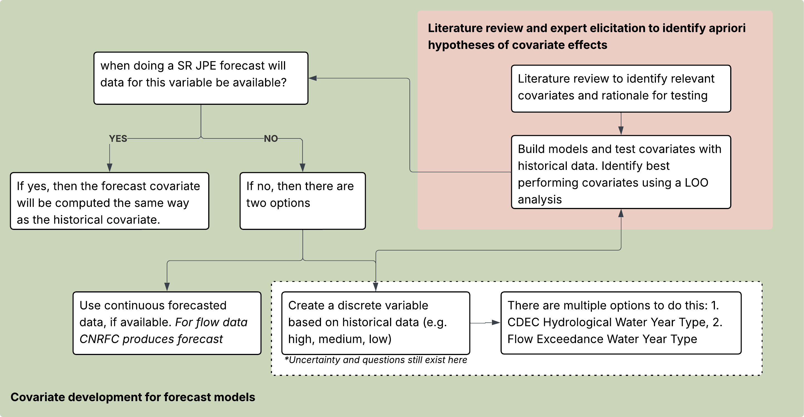

```{r, include = FALSE}
knitr::opts_chunk$set(
  collapse = TRUE,
  warning = FALSE, 
  message = FALSE,
  echo = FALSE,
  comment = "#>", 
  fig.width=8, fig.height=5)

library(tidyverse)
library(SRJPEdata)
library(lubridate)
library(CDECRetrieve)
library(dplyr)
library(dataRetrieval)
library(knitr)

colors_full <-  c("#9A8822", "#F5CDB4", "#F8AFA8", "#FDDDA0", "#74A089", #Royal 2
                  "#899DA4", "#C93312", "#DC863B", # royal 1 (- 3)
                  "#F1BB7B", "#FD6467", "#5B1A18", # Grand Budapest 1 (-4)
                  "#D8B70A", "#02401B", "#A2A475", # Cavalcanti 1
                  "#E6A0C4", "#C6CDF7", "#D8A499", "#7294D4", #Grand Budapest 2
                  "#9986A5", "#EAD3BF", "#AA9486", "#B6854D", "#798E87" # Isle of dogs 2 altered slightly
)

sr_covariates <- SRJPEdata::stock_recruit_covariates
source(here::here("data-raw", "pull_data_scripts", "pull_environmental_data.R"))
standard_flow <- flow_daily
```


This vignette focuses on developing covariates that could be used in forecast or scenario SR JPE models. We build upon prior work that identified and tested covariates using historical data,  and transition to how those covariates are adapted for use in forecast or scenario scenarios.

## Process for developing forecast covariates

The diagram outlines the process for developing covariates for forecast and scenario models. 

Some covariates were selected and evaluated based on literature review and expert input, followed by testing with historical data using leave-one-out (LOO) analysis. 

As we transition to forecast and scenario model application, we need to find out if the data for a given covariate will be available at the time of forecasting. If yes, the covariate will be included in the forecast model using the same structure as the historical covariate. If the answer is no, meaning the covariate data will not be available during the forecaste period, then two strategies are considered:

  1. Use continuous forecast data, if available
  
  2. Create a discrete covariate based on historical data: restructure and bin the variable into categories based on historical conditions (e.g. high, medium, low)

{width="108%"}


## Covariates included in forecast models

```{r include=FALSE}
covariate_table <- tibble::tibble(
  name = c("spawning/incubation minimum flow",
    "spawning/incubation maximum flow",
    "spawning/incubation maximum temperature",
    "above 13C threshold",
    "3-category water year type", 
    "3-category flow exceedance year type",
    "monthly reservoir storage",
    "monthly peak flow"),
  description = c("Use daily max flows for the spawning/incubation time period (Aug-Dec) and then calculate the minimum. This variable is available for all 4 time periods and would be the same because we are using data from the previous Aug-Dec.",
                  "Use daily max flows for the spawning/incubation time period (Aug-Dec) and then calculate the maximum. This variable is available for all 4 time periods and would be the same because we are using data from the previous Aug-Dec.",
                  "Summarizes the weekly maximum temperature for each stream (meaning it finds the max across all sites/subsites) within the spawning period. Note that the Sacramento River temperature data does not currently include a daily maximum so the weekly max is the max of the mean. An annual value is calculated by taking the max of the weekly max. This variable is available for all 4 time periods and would be the same because we are using data from the previous Aug-Dec.",
                  "This covariate is defined as the week of the year when the 7DADM is above 13C. Data are filtered to Mar-Dec because this is the time period where spring run are in the tributaries and may be experiencing temperature stress. Note, we currently do not have max daily temperatures for the Sacramento so mainstem is not included. This variable is available for all 4 time periods and would be the same because we are using data from the previous Aug-Dec.",
                  "Use water year type from CDEC for the Sacramento Valley and aggregate into 3 categories: C, D/BN/AN, W. This is a scenario based covariate meaning we do not need any data for the forecast. All 3 categories would be run for the forecast.",
                  "Use the flow exceedance methodology provided by the CDFW Instream Flow team (find mean annual flow by water year for each stream and rank the water years where the top 33% are wet, middle are average, bottom are dry) to categorize years for each stream into 3 categories: wet, average, dry",
                  "Using reservoir storage data, calculate the monthly max storage. For each JPE date we would use data from the month prior (e.g for Jan 1 it would be average for Dec)",
                  "Calculate the peak flow for each watershed and month. This would be different based on JPE date"))


```


```{r covariate-table, echo=FALSE}
kable(covariate_table, caption = "Covariate Descriptions")
```

*Note that this covariate list will be iteratively updated and improved*

## Preparing covariates

### Continuous variables

#### Spawning and incubation flow variables

These data are pulled from `stock_recruit_covarites`

- **min flow**: Use daily max flows for the spawning/incubation time period (Aug-Dec) and then calculate the minimum
- **max flow**: Use daily max flows for the spawning/incubation time period (Aug-Dec) and then calculate the maximum

```{r, include = F}
si_min_flow <- sr_covariates |> 
filter(lifestage == "spawning and incubation", covariate_structure == "min_flow") |> 
  as_tibble() |> 
  mutate(name = "si_min_flow",
         water_year = NA,
         # jpe_date = NA_Date_
         ) |> 
  select(name, year, water_year, stream, value) |> 
  glimpse()

si_max_flow <- sr_covariates |> 
filter(lifestage == "spawning and incubation", covariate_structure == "max_flow") |> 
  as_tibble() |> 
  mutate(name = "si_max_flow",
         water_year = NA,
         # jpe_date = NA_Date_,
         ) |> 
  select(name, year, water_year, stream, value)
```

#### Spawning and incubation temperature variables

These data are pulled from `stock_recruit_covarites`

- **max temp**: Summarizes the weekly maximum temperature for each stream (meaning it finds the max across all sites/subsites) within the spawning period. Note that the Sacramento River temperature data does not currently include a daily maximum so the weekly max is the max of the mean. An annual value is calculated by taking the max of the weekly max.
- **above 13C threshold**: This covariate is defined as the week of the year when the 7DADM is above 13C. Data are filtered to Mar-Dec because this is the time period where spring run are in the tributaries and may be experiencing temperature stress. This includes holding as well as spawning and incubation time period.

```{r, include = F}
si_max_temp <- sr_covariates |> 
filter(lifestage == "spawning and incubation", covariate_structure == "weekly_max_temp_max") |>  
  as_tibble() |> 
  mutate(name = "si_max_temp",
         water_year = NA,
         # jpe_date = NA_Date_,
         ) |> 
  select(name, year, water_year, stream, value) |> 
  glimpse()

above_13 <- sr_covariates |> 
  filter(covariate_structure == "above_13_temp_week") |>
  as_tibble() |> 
  mutate(name = "above_13",
         water_year = NA,
         # jpe_date = NA_Date_,
         ) |>
  select(name, year, water_year, stream, value) 
```

#### Reservoir storage

- **monthly reservoir storage**: Using reservoir storage data, calculate the monthly average storage for Keswick Reservoir and Shasta Reservoir. For each JPE date we would use data from the month prior (e.g for Jan 1 it would be average for Dec). This data contains monthly reservoir storage volumes (acre-feet) for Keswick Reservoir (KES), retrieved from the California Data Exchange Center (CDEC) operated by the California Department of Water Resources (DWR) and Shasta Reservoir USGS (11370000). 

For Keswick - the earliest data available is in 1965. Stream is NA because it applies to all streams and should not be joined on stream.

For Shasta - the earliest data available is in _TODO_ Stream is NA because it applies to all streams and should not be joined on stream.

**Keswick Reservoir (KES)**

```{r, include = F}
# Pull monthly reservoir storage: https://cdec.water.ca.gov/dynamicapp/QueryMonthly?s=KES
# KESWICK
rs_keswick_monthly_raw <- cdec_query(station = "KES", sensor = "15", dur_code = "M", start_date = "1965-10-01")

rs_keswick_monthly <- rs_keswick_monthly_raw |> 
  mutate(date = as.Date(datetime),
         year = year(date),
         value = parameter_value,
         name = "rs_keswick_monthly",
         water_year = NA,
         month = month(date),
         # jpe_year = if_else(month == 1, year - 1, year),
         # jpe_month = if_else(month == 1, 12L, month - 1L),
         # jpe_date = make_date(year = jpe_year, month = jpe_month),
         # jpe_date = if_else(month == 1, 12L, month - 1L), # if we only want the month
         stream = NA) |> 
  filter(month %in% c(12, 1, 2, 3 )) |> 
  select(name, year, water_year, month, stream, value)  # should we add month as well?
 
```

Plot the last 10 years - note that data have been filtered to Dec-Mar for use in JPE forecasting

```{r, echo = F, message = F, warning = F}
rs_keswick_monthly |> 
  filter(year >= 2015) |> 
  mutate(year = as.factor(year)) |> 
  ggplot(aes(x = month, y = value, color = year)) +
  geom_point() +
  scale_color_manual(values = colors_full) +
  theme_bw()
```

**Shasta Reservoir (11370000)**

```{r, include = F}
# Pull monthly reservoir storage: https://waterdata.usgs.gov/monitoring-location/11370000/#dataTypeId=daily-00054-0&period=P10YKES

# SHASTA 
# note here that we are pulling the instantaneous value at midnight (statCd = 32400), which is the only way
# we can get the query to work. this matches the data provided by Flora in an excel:
# rs_shasta_monthly_raw <- readxl::read_excel(here::here("data-raw", 
#                                                        "helper-tables",
#                                                        "20250214_ShastaStorage_2013-2023.xlsx"))

rs_shasta_monthly_raw <- dataRetrieval::readNWISdv(siteNumbers = 11370000, statCd = 32400, parameterCd = "00054", 
                                                   startDate = "1950-01-01", endDate = "2025-01-01")

rs_shasta_monthly <- rs_shasta_monthly_raw |> 
  mutate(date = as.Date(Date),
         year = year(date),
         value = X_00054_32400,
         name = "rs_shasta_monthly",
         water_year = NA,
         month = month(date),
         # jpe_year = if_else(month == 1, year - 1, year),
         # jpe_month = if_else(month == 1, 12L, month - 1L),
         # jpe_date = make_date(year = jpe_year, month = jpe_month),
         # jpe_date = if_else(month == 1, 12L, month - 1L), # if we only want the month
         stream = NA) |> 
  group_by(month, name, year, water_year, stream) |> 
  summarise(value = mean(value, na.rm = TRUE)) |> 
  filter(month %in% c(12, 1, 2, 3 )) |> 
  select(name, year, water_year, month, stream, value)  # should we add month as well?
 
```

Plot the last 10 years - note that data have been filtered to Dec-Mar for use in JPE forecasting

```{r, echo = F, message = F, warning = F}
rs_shasta_monthly |> 
  filter(year >= 2015) |> 
  mutate(year = as.factor(year)) |> 
  ggplot(aes(x = month, y = value, color = year)) +
  geom_point() +
  scale_color_manual(values = colors_full) +
  theme_bw()
```

#### Peak flow

- **monthly peak flow**: Calculate the peak flow for each watershed and month. This would be different based on JPE date. Takes the mean daily flow and finds the max for each month, year, and stream.

```{r, include = F}
# This requires running "pull_environmental_data.R"
peak_flow_monthly <- standard_flow |> 
  filter(statistic == "mean") |> 
  mutate(month = month(date),
         year = year(date),
         name = "monthly_max_flow") |>  
  group_by(stream, month, year, name) |> 
  summarize(value = max(value, na.rm = T))
```

Plot the last 10 years

```{r, echo = F, message = F, warning = F}
peak_flow_monthly |> 
  filter(year >= 2015) |> 
  mutate(year = as.factor(year)) |> 
  ggplot(aes(x = month, y = value, color = year)) +
  geom_line() +
  scale_color_manual(values = colors_full) +
  theme_bw() +
  facet_wrap(~stream, scales = "free_y")
```

### Scenario variales

#### 3-category water year type

  - This dataset provides annual Chronological Reconstructed Sacramento and San Joaquin Valley Water Year Hydrologic Classification Indices Based on measured unimpaired runoff (in million acre-feet). It was retrieved from the California Open Data Portal
  
```{r, include = F}
# https://data.ca.gov/dataset/cdec-water-year-type-dataset/resource/301aaef5-940d-4915-8ed6-baada4e101f5). Add on more recent years (need to find where best to pull 2023-2025)
#Process data into 3 categories: aggregate into 3 categories: C, D/BN/AN, W
wy_url <- "https://data.ca.gov/datastore/dump/301aaef5-940d-4915-8ed6-baada4e101f5?format=csv"

wy_raw <- read_csv(wy_url)

wy <- wy_raw |> 
  filter(!is.na(WY)) |> 
  mutate(wy_type = case_when(WYT %in% c("D", "BN", "AN") ~ "D/BN/AN",
                             T ~ WYT),
         year = NA,
         water_year = WY,
         name = "3_category_wy_type",
         stream = NA,
         # jpe_date = NA_Date_,
         text_value = wy_type) |>
  select(name, year, water_year, stream, text_value) 
```


```{r, echo = F, message = F, warning = F}
wy |> 
  #filter(year >= 2015) |> 
  ggplot(aes(x = water_year, y = text_value)) +
  geom_point() +
  scale_color_manual(values = colors_full) +
  theme_bw() +
  labs(y = "")
```

#### 3-category flow exceedance year type

  - This dataset defines the water year type for each stream based on the methodology outlined in the Standard Operating Procedure for Flow Duration Analysis in California [CDFW-IFP-005, August 2013](https://nrm.dfg.ca.gov/FileHandler.ashx?DocumentID=74183). It uses daily flow data from USGS gages to calculate the mean annual discharge (cfs) for each water year and location. Water years are then ranked by mean discharge within each stream and split into three categories:
  
    - Wet: Top 33%
    - Average: Middle 33%
    - Dry: Bottom 33%

```{r, include = F}
# Connect to the work Badhia did to create "flow exceedance" water year types based on CDFW calculations
# We can either source that script, or move the code here - ashley and badhia to discuss
gage_ids <- c(
  `battle creek` = "11376550",
  `butte creek` = "11390000",
  `clear creek` = "11372000",
  `deer creek` = "11383500",
  `feather river` = "11407000",
  `mill creek` = "11381500",
  `yuba river` = "11421000",
  `sacramento river` = "11390500"
)

start_date <- format(Sys.Date() - 30*365, "%Y-%m-%d")  # ~30 years ago
end_date <- format(Sys.Date(), "%Y-%m-%d")

flow_list <- lapply(gage_ids, function(site) {
  readNWISdv(siteNumbers = site, parameterCd = "00060",
             startDate = start_date, endDate = end_date)
})

combined_flow <- bind_rows(
  lapply(names(flow_list), function(name) {
    flow_list[[name]] |>
      mutate(
        date = as.Date(Date),
        flow_cfs = X_00060_00003,
        site_name = name,
        month = month(date),
        year = year(date),
        water_year = ifelse(lubridate::month(date) >= 10,
                            lubridate::year(date) + 1,
                            lubridate::year(date))) |>
      select(site_name, date, flow_cfs, month, year, water_year)
  }))

mean_discharge_by_site <- combined_flow |>
  group_by(site_name, water_year) |>
  summarize(mean_discharge = mean(flow_cfs, na.rm = TRUE), .groups = "drop")

# rank and assign water year type within each stream
# water_year_types <- mean_discharge_by_site |>
#   group_by(site_name) |>
#   arrange(desc(mean_discharge)) |>
#   mutate(rank = row_number(),
#          n_years = n(),  # total water years per site
#          water_year_type = case_when(rank <= n_years / 3 ~ "Wet",
#                                      rank > 2 * n_years / 3 ~ "Dry",
#                                      TRUE ~ "Average")) |>
#   ungroup() |> 
#   glimpse()

# Calculate flow exceedance and then use that to split up. This is pretty much the same
# as the ranked and divide by 3 approach. Using this for consistently with CDFW.
# P = 100 * [ M / (n + 1) ]

water_year_types <- mean_discharge_by_site |> 
  group_by(site_name) |>
  arrange(desc(mean_discharge)) |>
  mutate(rank = row_number(),
         n_years = n(),
         exceedance_probability = 100*(rank/(n_years + 1)),
         water_year_type = case_when(exceedance_probability <= 33.3 ~ "Wet",
                                     exceedance_probability > 33.3 & exceedance_probability <= 66.3 ~ "Average",
                                     T ~ "Dry"))

flow_water_year_type <- water_year_types |> 
  mutate(name = "3_category_flow_exceedance_year_type", 
         year = NA,
         stream = site_name,
         # jpe_date = NA_Date_,
         text_value = as.character(water_year_type)) |> 
  ungroup() |> 
  select(name, year, water_year, stream, text_value)
```


```{r, echo = F, message = F, warning = F}
# flow_water_year_type |> 
#   ggplot(aes(x = water_year, y = text_value)) +
#   geom_point() +
#   scale_color_manual(values = colors_full) +
#   theme_bw() +
#   labs(y = "") +
#   facet_wrap(~stream)


flow_water_year_type |> 
  mutate(value = case_when(text_value == "Wet" ~ 3,
                           text_value == "Average" ~ 2,
                           T ~ 1)) |> 
  ggplot(aes(x = water_year, y = value)) +
  geom_line() +
  #scale_color_manual(values = colors_full) +
  theme_bw() +
  labs(y = "") +
  facet_wrap(~stream)

```


## Combine and save data

```{r echo=FALSE, message = F, warning = F}
forecast_covariates <- bind_rows(si_min_flow, si_max_flow, si_max_temp, above_13, rs_keswick_monthly, rs_shasta_monthly, flow_water_year_type, wy, peak_flow_monthly) |> glimpse()

#checks
# unique(forecast_covariates$name)
# unique(forecast_covariates$stream)
# filter(forecast_covariates, !name %in% c("rs_monthly", "3_category_wy_type") & is.na(stream))

knitr::kable(head(forecast_covariates, 10))
```

```{r}
usethis::use_data(forecast_covariates, overwrite = TRUE)
```