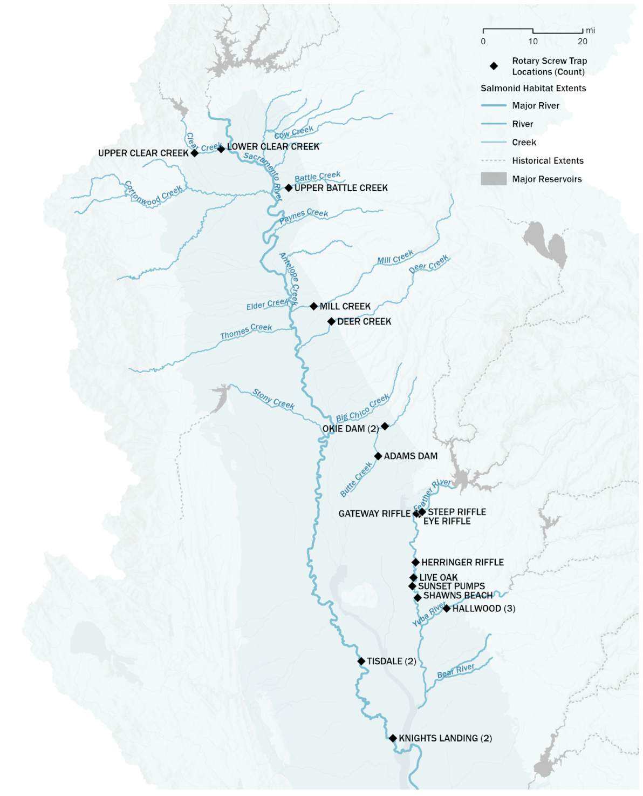

```{r, include = FALSE}
library(tidyverse)
library(lubridate)
knitr::opts_chunk$set(
  message = FALSE,
  warning = FALSE,
  fig.width=8, fig.height=6
)
```

```{r setup, echo = FALSE}
library(SRJPEdata)
# source(here::here("data-raw", "pull_tables_from_database.R"))

colors_small <-  c("#9A8822", "#F5CDB4", "#F8AFA8", "#FDDDA0", "#74A089", #Royal 2
                            "#899DA4", "#C93312", "#DC863B" # royal 1 (- 3)
)
colors_full <-  c("#9986A5", "#C18748", #Royal 2
                  "#899DA4", "#9A8822", # Grand Budapest 1 (-4)
                  "#02401B", "#A2A475", # Cavalcanti 1
                  "#E6A0C4", "#C6CDF7", "#D8A499", "#7294D4", #Grand Budapest 2
                  "#9986A5", "#EAD3BF", "#AA9486", "#B6854D", "#798E87", # Isle of dogs 2 altered slightly
                  "#AC9765", "#b67c3b", "#175149", "#AF4E24", "#CEB175",
                  "#E54E21", "#6C8645", "#C18748", "#FBA72A", "#D3D4D8", "#CB7A5C", "#5785C1")

```

### Overview

The spring run juvenile production estimate (SR JPE) contains a suite of submodels that rely on different datasets. This document is currently focused on Chinook monitoring data that will be used to fit the stock recruit model.

## Stock Recruit Rotary Screw Trap Site Selection Overview

The Spring Run JPE model considers data from 7 tributaries and the mainstem Sacramento river, including:

-   Battle Creek
-   Butte Creek
-   Clear Creek
-   Deer Creek
-   Feather River
-   Mill Creek
-   Yuba River

Each of these tributaries has a unique monitoring setup and number of Rotary Screw Traps that we can use in the SR JPE model. This vignette describes the trapping sites that we use for each tributary.

## Classifying RST site usage

**Primary site selected for SRJPE stock recruit:** When a stream has multiple tributaries, we selected one primary site to use for the SRJPE stock recruit model. Primary sites typically have the longest period of trapping and include the largest extent of spawners on a tributary.

**Secondary site selected used for supplementary analysis and abundance estimate:**

-   Any trap not selected for the SR JPE stock recruit model will still be used in juvenile abundance modeling. The BTSPAS-X juvenile abundace model is a hierarchical basin abundance model that can borrow information from one site when there is no information available at a different site.

-   Some sites not selected for the SR JPE stock recruit model may also be used for supplementary analysis. These analysis could include analyzing run proportions by looking at abundance numbers above and below a weir or looking at survival rates of juveniles between RST sites.

### Map

The map below shows the location of existing Rotary Screw trapping sites.

```{r, echo = FALSE}
library(leaflet)
library(rgdal)
library(sf)
library(leaflet.extras2)

salmonid_extents <- readOGR("data-raw/helper-tables/habitat_extents/salmonid_habitat_extents.shp", 
                            stringsAsFactors = FALSE, verbose = FALSE) %>%
  spTransform(CRS("+proj=longlat +datum=WGS84 +no_defs"))

srjpe_systems <- c("Battle Creek", "Butte Creek", "Clear Creek", "Mill Creek", "Deer Creek", "Feather River", "Yuba River", "Upper Sacramento River", "Upper-mid Sacramento River", "Lower-mid Sacramento River", "Lower Sacramento River")

sprjpe <- subset(salmonid_extents, Species == 'Spring Run Chinook' & River %in% srjpe_systems)
```

```{r, echo = FALSE, warning = FALSE, message = FALSE}
# make_label <- function(data) {
#   labels <- data$River
# }
# 
# hab_map <- leaflet() %>% 
#       # addProviderTiles(providers$Esri.WorldTopoMap, group = "Map") %>% 
#       # addProviderTiles(providers$Esri.WorldImagery, group = "Satellite") %>%
#       addProviderTiles(providers$CartoDB.Positron) |> 
#       addPolylines(data = sprjpe, group = 'Spring Run Extent', label = make_label(sprjpe),
#                    color = '#517ba8', opacity = .8, weight = 3) %>% 
#       setView(lat = 38.85, lng = -121.49, zoom = 7.5) 
# 
# hab_map

```

{width=108%}

## Table of RST sites 

The table below summarized site selection for the SR JPE stock recruit model. If a site has multiple subsites fishing on the same day these will be added together to get total catch or efficiency data for a day.

See sections below on each tributary to understand why sites were recommended as primary sites for stock recruit.

+------------------+--------------------------+-------------------------------------------------------------------------------------------------------------------+----------------------------------------------------------------------------------------------------------------------------------------------------------------------------------------------------------------------------------------------------------------------------------------------------------------------------------------+-------------------------------------------------+
| **Stream**       | **Site Group**           | **Site**                                                                                                          | **Subsite**                                                                                                                                                                                                                                                                                                                            | **Recccomended Primary Site for Stock Recruit** |
+------------------+--------------------------+-------------------------------------------------------------------------------------------------------------------+----------------------------------------------------------------------------------------------------------------------------------------------------------------------------------------------------------------------------------------------------------------------------------------------------------------------------------------+-------------------------------------------------+
| battle creek     |                          | ubc                                                                                                               | ubc                                                                                                                                                                                                                                                                                                                                    | ubc                                             |
+------------------+--------------------------+-------------------------------------------------------------------------------------------------------------------+----------------------------------------------------------------------------------------------------------------------------------------------------------------------------------------------------------------------------------------------------------------------------------------------------------------------------------------+-------------------------------------------------+
| butte creek      |                          | adams dam,                                                                                                        | adams dam, okie dam 1, okie dam 2, okie dam fyke, okie dam rst                                                                                                                                                                                                                                                                         | okie dam                                        |
|                  |                          |                                                                                                                   |                                                                                                                                                                                                                                                                                                                                        |                                                 |
|                  |                          | okie dam                                                                                                          |                                                                                                                                                                                                                                                                                                                                        |                                                 |
+------------------+--------------------------+-------------------------------------------------------------------------------------------------------------------+----------------------------------------------------------------------------------------------------------------------------------------------------------------------------------------------------------------------------------------------------------------------------------------------------------------------------------------+-------------------------------------------------+
| clear creek      |                          | lcc, ucc                                                                                                          | lcc, ucc                                                                                                                                                                                                                                                                                                                               | lcc                                             |
+------------------+--------------------------+-------------------------------------------------------------------------------------------------------------------+----------------------------------------------------------------------------------------------------------------------------------------------------------------------------------------------------------------------------------------------------------------------------------------------------------------------------------------+-------------------------------------------------+
| deer creek       |                          | deer creek                                                                                                        | deer creek                                                                                                                                                                                                                                                                                                                             | deer creek                                      |
+------------------+--------------------------+-------------------------------------------------------------------------------------------------------------------+----------------------------------------------------------------------------------------------------------------------------------------------------------------------------------------------------------------------------------------------------------------------------------------------------------------------------------------+-------------------------------------------------+
| feather river    | feather lfc, feather hfc | eye riffle, gateway riffle, steep riffle, herringer riffle, live oak, shawns beach, sunset pumps, lower feather\* | eye riffle_north, eye riffle_side channel, gateway main 400' up river, gateway_main1, gateway_rootball, gateway_rootball_river_left, #steep riffle_rst, steep riffle_10' ext, steep side channel, herringer_east, herringer_upper_west, herringer_west, live oak, shawns_east, shawns_west, sunset east bank, sunset west bank, rr, rl | feather hfc - herringer riffle                  |
+------------------+--------------------------+-------------------------------------------------------------------------------------------------------------------+----------------------------------------------------------------------------------------------------------------------------------------------------------------------------------------------------------------------------------------------------------------------------------------------------------------------------------------+-------------------------------------------------+
| mill creek       |                          | mill creek                                                                                                        | mill creek                                                                                                                                                                                                                                                                                                                             | mill creek                                      |
+------------------+--------------------------+-------------------------------------------------------------------------------------------------------------------+----------------------------------------------------------------------------------------------------------------------------------------------------------------------------------------------------------------------------------------------------------------------------------------------------------------------------------------+-------------------------------------------------+
| sacramento river |                          | tisdale, knights landing, delta entry\*                                                                           | rr, rl, 8.3, 8.4                                                                                                                                                                                                                                                                                                                       | knights landing                                 |
+------------------+--------------------------+-------------------------------------------------------------------------------------------------------------------+----------------------------------------------------------------------------------------------------------------------------------------------------------------------------------------------------------------------------------------------------------------------------------------------------------------------------------------+-------------------------------------------------+
| yuba river       |                          | hallwood, yuba river                                                                                              | yub, hal, hal2, hal3                                                                                                                                                                                                                                                                                                                   | hallwood                                        |
+------------------+--------------------------+-------------------------------------------------------------------------------------------------------------------+----------------------------------------------------------------------------------------------------------------------------------------------------------------------------------------------------------------------------------------------------------------------------------------------------------------------------------------+-------------------------------------------------+

## Choosing Sites

### Battle Creek

On Battle Creek there are 2 rotary screw trapping sites.

***Primary site selected: Upper Battle Creek.***

The SRJPE modeling team selected Upper Battle Creek as the primary site to use for the stock recruit because it has a longer period of record and is still an ongoing monitoring site.

***Secondary site*****:**

Lower Battle Creek efficiency or catch data may be used in fitting the juvenile abundance estimate model (BTSPAS) and for supplementary analysis. If the Battle Creek monitoring team adds LBC RST back into ongoing monitoring, this site may be used in combination with UBC for the stock recruit.

### Butte Creek

Historically, multiple rotary screw trapping sites have operated on the Yuba River. Currently, only 1 site is in operation, the Okie Dam site.

***Primary site selected: Okie Dam***

The SRJPE modeling team selected Okie Dam as the primary site to use for the stock recruit because it is the site with the most historical data and has ongoing monitoring. The Okie Dam site has a rotary screw trap and a fyke trap in operation during the monitoring season.

***Secondary site*****:**

Additional Adams Dam efficiency or catch data may be used in fitting the juvenile abundance estimate model (BTSPAS) and for supplementary analysis.

### Clear Creek

On Clear Creek there are 2 rotary screw trapping sites.

***Primary site selected: Lower Clear Creek.***

The SRJPE modeling team selected Lower Clear Creek as the primary site to use for the stock recruit because it captures the full extent of spawning ground for spring run Chinook.

***Secondary site*****:**

Upper Clear Creek efficiency or catch data may be used in fitting the juvenile abundance estimate model (BTSPAS) and for supplementary analysis. There is a separation weir on Clear Creek that ensures that only spring run Chinook are caught in the UCC trap. This may prove helpful for potential supplementary analysis focused run identification including:

-   Use for understanding of run & potential survival between traps\
-   Comparison UCC (all spring) to LCC PLAD results

IF for some reason LCC (SR based on plad) and UCC counts do not align, we can reassess our decision to use LCC as our primary trap. In this case, we will have to do an spawning adult data analysis to come up with an adult scaling factor to ensure that we are scaling up our UCC estimates to account for downstream spawerns that we are missing.

### Deer Creek

There is only one RST operated on Deer Creek. This trap will be used in the Stock Rectuit.

### Feather River

On Feather River there are many rotary screw trapping sites. Consistently, a Low Flow Channel (between Orville Dam and the Thermalito after bay) and a High Flow Channel (after Thermalito after bay) are monitored each year. In 2023 (TODO check date) a new RST program started on the Lower Feather River below the confluence with the Yuba River. This RST captures juveniles from both Yuba and Feather rivers.

***Primary site selected: Herringer Riffle (High Flow Channel)***

The SRJPE modeling team selected Herringer Riffle as the primary site to use for the stock recruit because it has the most consistent monitoring in the high flow channel, it is still an ongoing monitoring site, and it captures the full extent of spring run spawners. Additional sites will be used to fill data gaps on the HFC if Herringer is not fishing in a given year.

***Secondary site*****:**

Eye Riffle efficiency or catch data may be used in fitting the juvenile abundance estimate model (BTSPAS) and for supplementary analysis. After initial analysis, we will reassess site decision to see how to best incoperate Eye Riffle data in modeling.

*Additional considerations for Feather River*

The Lower Feather River site will be used in the Spring Run JPE modeling but will not be used directly to fit a stock recruit in a tributary specific model. This could be used in as part of a mainstem model or to do a joint Feather and Yuba river model.

### Mill Creek

There is only one RST operated on Deer Creek. This trap will be used in the Stock Rectuit.

### Yuba River

Historically, multiple rotary screw trapping sites have operated on the Yuba River. Currently, only 1 site is in operation, the Hallwood site.

***Primary site selected: Hallwood***

The SRJPE modeling team selected Hallwood as the primary site to use for the stock recruit because it is the site with the most historical data, it is the lowest in the system, and ongoing monitoring at this site restarted in 2023 (TODO check year on this).

***Secondary site:***

Additional Yuba River efficiency or catch data may be used in fitting the juvenile abundance estimate model (BTSPAS) and for supplementary analysis.
