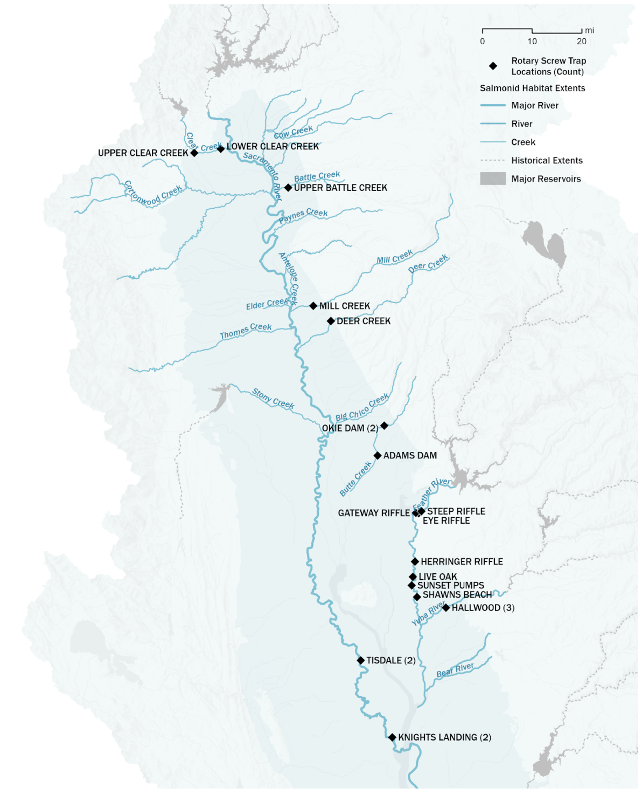

```{r, include = FALSE}
library(tidyverse)
library(lubridate)
knitr::opts_chunk$set(
  message = FALSE,
  warning = FALSE,
  fig.width=8, fig.height=6
)
```

```{r setup, echo = FALSE}
library(SRJPEdata)
# source(here::here("data-raw", "pull_tables_from_database.R"))

colors_small <-  c("#9A8822", "#F5CDB4", "#F8AFA8", "#FDDDA0", "#74A089", #Royal 2
                            "#899DA4", "#C93312", "#DC863B" # royal 1 (- 3)
)
colors_full <-  c("#9986A5", "#C18748", #Royal 2
                  "#899DA4", "#9A8822", # Grand Budapest 1 (-4)
                  "#02401B", "#A2A475", # Cavalcanti 1
                  "#E6A0C4", "#C6CDF7", "#D8A499", "#7294D4", #Grand Budapest 2
                  "#9986A5", "#EAD3BF", "#AA9486", "#B6854D", "#798E87", # Isle of dogs 2 altered slightly
                  "#AC9765", "#b67c3b", "#175149", "#AF4E24", "#CEB175",
                  "#E54E21", "#6C8645", "#C18748", "#FBA72A", "#D3D4D8", "#CB7A5C", "#5785C1")

stock_recruit_site_table <- SRJPEdata::stock_recruit_year_lookup 
```

### Overview

The spring run juvenile production estimate (SR JPE) contains a suite of submodels that rely on different datasets. This document is currently focused on Chinook monitoring data that will be used to fit the Stock Recruit model. The Within Season model is in development and is currently not considered here.

## Stock Recruit Rotary Screw Trap Site Selection Overview

The Spring Run JPE model considers data from 7 tributaries and the mainstem Sacramento river, including:

-   Battle Creek
-   Butte Creek
-   Clear Creek
-   Deer Creek
-   Feather River
-   Mill Creek
-   Yuba River

Each of these tributaries has a unique monitoring setup and number of rotary screw traps (RSTs) that we can use in the SR JPE model. Data for the SR JPE is organized by stream, site, and subsite. `stream` represents the creek or river where the trapping sites are located. `site` represents a unique trapping location whereas `subsite` represents the RST positioning within the `site`. `site group` is used as a helper to group sites that may be more similar than others. For instance, on the Feather River there are multiple sites that have been used over time. It is assumed that sites within the Low Flow Channel are more similar to each other than the sites in the High Flow Channel and vice versa. Some streams only have one site and some sites only have one RST. The important difference is that catch from different subsites within the same site and same year can be added together, whereas catch from different sites cannot be added together as this would be double counting.

This vignette describes the trapping sites that we use for each tributary.

## Classifying RST site usage

**Primary site selected for SR JPE Stock Recruit:** When a stream has multiple tributaries, we selected one primary site to use for the SR JPE Stock Recruit model. Primary sites typically have the longest period of trapping and include the largest extent of spawners on a tributary.

**Secondary site selected used for supplementary analysis and abundance estimate:**

-   Any trap not selected for the SR JPE Stock Recruit model will still be used in juvenile abundance modeling. The BTSPAS-X juvenile abundance model is a hierarchical basin abundance model that can borrow information from one site when there is no information available at a different site.

-   Some sites not selected for the SR JPE Stock Recruit model may also be used for supplementary analysis. These analysis could include analyzing run proportions by looking at abundance numbers above and below a weir or looking at survival rates of juveniles between RST sites.

### Map

The map below shows the location of existing RST sites.

{width="108%"}

## Table of RST sites

The table below is a summary of site selection for the SR JPE Stock Recruit model. If a site has multiple subsites fishing on the same day these will be added together to get total catch or efficiency data for a day.

See sections below on each tributary to understand why sites were recommended as primary sites for Stock Recruit.

+------------------+--------------------------------------+-----------------------------------------------------------------------------------------------------------------+----------------------------------------------------------------------------------------------------------------------------------------------------------------------------------------------------------------------------------------------------------------------------------------------------------------------------------------+------------------------------------------------+
| **Stream**       | **Site Group**                       | **Site**                                                                                                        | **Subsite**                                                                                                                                                                                                                                                                                                                            | **Recommended Primary Site for Stock Recruit** |
+------------------+--------------------------------------+-----------------------------------------------------------------------------------------------------------------+----------------------------------------------------------------------------------------------------------------------------------------------------------------------------------------------------------------------------------------------------------------------------------------------------------------------------------------+------------------------------------------------+
| battle creek     | battle creek                         | ubc                                                                                                             | ubc                                                                                                                                                                                                                                                                                                                                    | ubc                                            |
+------------------+--------------------------------------+-----------------------------------------------------------------------------------------------------------------+----------------------------------------------------------------------------------------------------------------------------------------------------------------------------------------------------------------------------------------------------------------------------------------------------------------------------------------+------------------------------------------------+
| butte creek      | butte creek                          | adams dam,                                                                                                      | adams dam, okie dam 1, okie dam 2, okie dam fyke, okie dam rst                                                                                                                                                                                                                                                                         | okie dam                                       |
|                  |                                      |                                                                                                                 |                                                                                                                                                                                                                                                                                                                                        |                                                |
|                  |                                      | okie dam                                                                                                        |                                                                                                                                                                                                                                                                                                                                        |                                                |
+------------------+--------------------------------------+-----------------------------------------------------------------------------------------------------------------+----------------------------------------------------------------------------------------------------------------------------------------------------------------------------------------------------------------------------------------------------------------------------------------------------------------------------------------+------------------------------------------------+
| clear creek      | clear creek                          | lcc, ucc                                                                                                        | lcc, ucc                                                                                                                                                                                                                                                                                                                               | ucc                                            |
+------------------+--------------------------------------+-----------------------------------------------------------------------------------------------------------------+----------------------------------------------------------------------------------------------------------------------------------------------------------------------------------------------------------------------------------------------------------------------------------------------------------------------------------------+------------------------------------------------+
| deer creek       | deer creek                           | deer creek                                                                                                      | deer creek                                                                                                                                                                                                                                                                                                                             | deer creek                                     |
+------------------+--------------------------------------+-----------------------------------------------------------------------------------------------------------------+----------------------------------------------------------------------------------------------------------------------------------------------------------------------------------------------------------------------------------------------------------------------------------------------------------------------------------------+------------------------------------------------+
| feather river    | feather river lfc, feather river hfc | eye riffle, gateway riffle, steep riffle, herringer riffle, live oak, shawns beach, sunset pumps, lower feather | eye riffle_north, eye riffle_side channel, gateway main 400' up river, gateway_main1, gateway_rootball, gateway_rootball_river_left, #steep riffle_rst, steep riffle_10' ext, steep side channel, herringer_east, herringer_upper_west, herringer_west, live oak, shawns_east, shawns_west, sunset east bank, sunset west bank, rr, rl | eye riffle                                     |
+------------------+--------------------------------------+-----------------------------------------------------------------------------------------------------------------+----------------------------------------------------------------------------------------------------------------------------------------------------------------------------------------------------------------------------------------------------------------------------------------------------------------------------------------+------------------------------------------------+
| mill creek       | mill creek                           | mill creek                                                                                                      | mill creek                                                                                                                                                                                                                                                                                                                             | mill creek                                     |
+------------------+--------------------------------------+-----------------------------------------------------------------------------------------------------------------+----------------------------------------------------------------------------------------------------------------------------------------------------------------------------------------------------------------------------------------------------------------------------------------------------------------------------------------+------------------------------------------------+
| sacramento river | knights landing, tisdale             | tisdale, knights landing, delta entry                                                                           | rr, rl, 8.3, 8.4                                                                                                                                                                                                                                                                                                                       | knights landing                                |
+------------------+--------------------------------------+-----------------------------------------------------------------------------------------------------------------+----------------------------------------------------------------------------------------------------------------------------------------------------------------------------------------------------------------------------------------------------------------------------------------------------------------------------------------+------------------------------------------------+
| yuba river       | yuba river                           | hallwood, yuba river                                                                                            | yub, hal, hal2, hal3                                                                                                                                                                                                                                                                                                                   | hallwood                                       |
+------------------+--------------------------------------+-----------------------------------------------------------------------------------------------------------------+----------------------------------------------------------------------------------------------------------------------------------------------------------------------------------------------------------------------------------------------------------------------------------------------------------------------------------------+------------------------------------------------+

## Choosing Sites

### Battle Creek

On Battle Creek there are 2 rotary screw trapping sites.

***Primary site selected: Upper Battle Creek.***

The SR JPE modeling team selected Upper Battle Creek as the primary site to use for the Stock Recruit because it has a longer period of record and is still an ongoing monitoring site.

***Secondary site*****:**

Lower Battle Creek efficiency or catch data may be used in fitting the juvenile abundance estimate model (BTSPAS-X) and for supplementary analysis. If the Battle Creek monitoring team adds LBC RST back into ongoing monitoring, this site may be used in combination with UBC for the Stock Recruit.

**Table of Year, Stream, and Site for Stock Recruit**

```{r, echo = FALSE}
battle_sr <- stock_recruit_site_table |>  
  filter(stream == "battle creek") |> 
  select(stream, site, run_year, rst, brood_year, adult)

knitr::kable(battle_sr) 
```

### Butte Creek

Historically, multiple rotary screw trapping sites have operated on Butte Creek. Currently, only 1 site is in operation, the Okie Dam site, also referred to as Parrott-Phalen Diversion Dam.

***Primary site selected: Okie Dam***

The SR JPE modeling team selected Okie Dam as the primary site to use for the Stock Recruit because it is the site with the most historical data and has ongoing monitoring. The Okie Dam site has a rotary screw trap and a fyke trap in operation during the monitoring season. Currently, data is considered complete only when the RST is operating. This means that the few records where only the fyke trap was operating are not currently used in juvenile abundance modelling. In the future, these data may be integrated, though this would require an approach to understand the portion of the river sampled by the fyke trap to better represent effort.

***Secondary site*****:**

Additional Adams Dam efficiency or catch data may be used in fitting the juvenile abundance estimate model (BTSPAS-X) and for supplementary analysis.

**Table of Year, Stream, and Site for Stock Recruit**

```{r, echo = FALSE}
butte_sr <- stock_recruit_site_table |>  
  filter(stream == "butte creek") |> 
  select(stream, site, run_year, rst, brood_year, adult)

knitr::kable(butte_sr) 
```

### 

### Clear Creek

On Clear Creek there are 2 rotary screw trapping sites.

***Primary site selected: Upper Clear Creek.***

The SR JPE modeling team selected Upper Clear Creek (UCC) as the primary site to use for the Stock Recruit because it is most representative of spring run due to the separation weir.

***Secondary site*****:**

Lower Clear Creek efficiency or catch data may be used in fitting the juvenile abundance estimate model (BTSPAS-X) and for supplementary analysis. There is a separation weir on Clear Creek that ensures that only spring run Chinook are caught in the UCC trap. This may prove helpful for potential supplementary analysis focused run identification including:

-   Use for understanding of run & potential survival between traps
-   Comparison UCC (all spring) to LCC PLAD results

**Table of Year, Stream, and Site for Stock Recruit**

```{r, echo = FALSE}
clear_sr <- stock_recruit_site_table |>  
  filter(stream == "clear creek") |> 
  select(stream, site, run_year, rst, brood_year, adult)

knitr::kable(clear_sr) 
```

### 

### Deer Creek

There is only one RST operated on Deer Creek. This trap will be used in the Stock Recruit.

**Table of Year, Stream, and Site for Stock Recruit**

```{r, echo = FALSE}
deer_sr <- stock_recruit_site_table |>  
  filter(stream == "deer creek") |> 
  select(stream, site, run_year, rst, brood_year, adult)

knitr::kable(deer_sr) 
```

### 

### Feather River

On Feather River there are many rotary screw trap sites. Consistently, a Low Flow Channel site (between the Fish Barrier Dam and the Thermalito Afterbay Outlet) and a High Flow Channel site (after Thermalito Afterbay Outlet) are monitored each year. In 2022, a new RST program started on the Lower Feather River below the confluence with the Yuba River. This RST captures juveniles from both Yuba and Feather rivers.

***Primary site selected: Eye Riffle (Low Flow Channel)***

The SR JPE modeling team selected Eye Riffle as the primary site to use for the Stock Recruit because it would enable direct integration with the Probabilistic Length At Date (PLAD) model as genetic data are being collected at this site. Additionally, the time series for this site is robust. In years where data are not available at Eye Riffle the dataset can be supplemented with Steep Riffle and Gateway Riffle which are both in the Low Flow Channel.

*Additional considerations for Feather River*

The Lower Feather River site will be used in the SR JPE modeling but will not be used directly to fit a Stock Recruit in a tributary specific model. This could be used in as part of a mainstem model or to do a joint Feather and Yuba river model.

**Table of Year, Stream, and Site for Stock Recruit**

```{r, echo = FALSE}
feather_sr <- stock_recruit_site_table |>  
  filter(stream == "feather river") |> 
  select(stream, site, run_year, rst, brood_year, adult)

knitr::kable(feather_sr) 
```

### 

### Mill Creek

There is only one RST operated on Mill Creek. This trap will be used in the Stock Recruit.

**Table of Year, Stream, and Site for Stock Recruit**

```{r, echo = FALSE}
mill_sr <- stock_recruit_site_table |>  
  filter(stream == "mill creek") |> 
  select(stream, site, run_year, rst, brood_year, adult)

knitr::kable(mill_sr)
```

### 

### Yuba River

Historically, data were collected at the Hallwood site on the Yuba River. Data collection at this site resumed in 2022.

There is only one RST location on Yuba River, referred to as Hallwood. This will be used in the Stock Recruit.

**Table of Year, Stream, and Site for Stock Recruit**

```{r, echo = FALSE}
yuba_sr <- stock_recruit_site_table |>  
  filter(stream == "yuba river") |> 
  select(stream, site, run_year, rst, brood_year, adult)

knitr::kable(yuba_sr)
```

###

## RST Monitoring Protocols

All sites use rotary screw traps (RSTs) to capture and enumerate juvenile Chinook salmon emigrating downstream. Despite operating under a shared general framework, each program has distinct equipment, sampling schedules, and efficiency trial methods reflecting local hydrology, fish populations, and staffing resources.

### Common Protocol Elements

All monitoring programs share the following core practices:

- **Daily servicing:** Traps are serviced once per 24-hour period, with more frequent checks required during high debris loads or large fish catches.
- **Flow-based shutdowns:** Trapping is suspended during unsafe high-flow conditions.
- **Environmental data:** Water temperature (°C) is collected at all sites. Most sites also collect turbidity; Sacramento River sites additionally collect dissolved oxygen, conductivity, and velocity.
- **Fork length measurement:** All sites record fork length (mm) for Chinook salmon, with run assignment based on length-at-date criteria (Greene 1992 at most sites; Fisher 1992 at Knights Landing and Tisdale).
- **Plus counts:** Fish not individually measured are enumerated by hand count.
- **Efficiency trial assumptions:** All programs assume negligible mortality between the release point and the trap.
- **Mark-recapture periods:** Most programs conduct efficiency trials December through April or May.

### Key Differences Across Programs

**Trap size and configuration**

Trap size varies by stream. The Battle Creek and Clear Creek programs use 5-foot diameter RSTs; Clear Creek RSTs are operated in a "half-cone" configuration during high salmon abundance to reduce live-box crowding. The Feather River, Yuba River, Butte Creek, and Sacramento River programs use 8-foot diameter RSTs. Butte Creek operates both an 8-foot RST and a Diversion Screen Trap (DST) at the Okie Dam site. The number of traps also varies: Battle Creek and Clear Creek operate 1–2 RSTs per site; Feather River operates up to 3 (two in tandem in the High Flow Channel plus one in the Low Flow Channel); Yuba River operates up to 3; Knights Landing and Tisdale each use two in-line RSTs.

**Monitoring season**

The operational calendar differs across streams:

| Stream | Monitoring Season |
|---|---|
| Battle Creek (UBC) | Year-round |
| Clear Creek | November – June 30 |
| Butte Creek | October – June |
| Deer Creek | October – June |
| Mill Creek | October – June |
| Feather River | November – July |
| Yuba River | November – June |
| Sacramento River (Knights Landing) | September – June |
| Sacramento River (Tisdale) | October – June |

**Fish measurement subsampling**

Measurement protocols differ in the number of fish measured and subsampling thresholds. Feather River and Yuba River measure up to 50 randomly selected Chinook per run type and up to 50 steelhead. Battle Creek and Clear Creek measure all fish when catch is below ~250 individuals, using a sequential halving procedure for larger catches. Mill and Deer creeks measure only 10 randomly selected Chinook and 10 non-salmonids. Butte Creek measures 50 Chinook and the first 10 steelhead. Knights Landing measures up to 100 Chinook per run.

**Efficiency trial fish source**

The origin of fish used for mark-recapture trials differs:

| Stream | Primary fish source for efficiency trials |
|---|---|
| Feather River | Natural-origin fall-run Chinook (primary) |
| Yuba River | Natural-origin Chinook (primary); Feather River Hatchery fish as surrogates when catch is low |
| Clear Creek (LCC/UCC) | Natural-origin Chinook |
| Battle Creek (UBC) | Hatchery-origin fish from Coleman National Fish Hatchery (CNFH) |
| Butte Creek | Natural-origin Chinook from RST and DST |
| Mill Creek | Hatchery-origin fall-run from CNFH |
| Deer Creek | Hatchery-origin fall-run from CNFH |
| Knights Landing | Trap-captured Chinook; CNFH fish when catch is insufficient |
| Tisdale | Trap-captured Chinook; CNFH fish when catch is insufficient |

**Efficiency trial frequency and minimum fishing requirement**

Protocols for most programs describe an intended trial frequency of once per week during the core monitoring period (typically December–April or May). Mill and Deer creeks describe bi-weekly trials (February–May) and require a minimum of 7 consecutive days of fishing after a release before a trial is considered valid. All other programs require a minimum of 3 consecutive days.

In practice, the number of trials conducted per year varies considerably across sites and years, as shown in the table below. Higher counts at Clear Creek and Feather River reflect multiple RST sites operating concurrently within the same stream and year.

```{r efficiency-trial-summary, echo = FALSE}
trials_by_site <- release |>
  mutate(
    date     = as.Date(date_released),
    month    = month(date),
    cal_year = year(date),
    run_year = if_else(month >= 12L, cal_year + 1L, cal_year)
  ) |>
  filter(month %in% c(12, 1, 2, 3, 4, 5, 6)) |>
  count(stream, site, run_year, name = "n_trials")

trial_summary <- trials_by_site |>
  group_by(stream, site) |>
  summarise(
    `First year` = min(run_year),
    `Avg trials/year` = round(mean(n_trials), 1),
    `Min` = min(n_trials),
    `Max` = max(n_trials),
    .groups = "drop"
  ) |>
  mutate(
    stream = tools::toTitleCase(stream),
    site   = tools::toTitleCase(site)
  ) |>
  rename(Stream = stream, Site = site)

knitr::kable(trial_summary,
  caption = "Summary of efficiency trial releases per run year (December–June) by site.
             Run year is defined as December of year Y through June of year Y+1."
)
```

Several notable patterns emerge from the observed trial counts:

**Feather River and Yuba River.** Site-level averages for Eye Riffle (~16/year) and Herringer Riffle (~18/year) are consistent with a roughly weekly December–April schedule. Yuba River (Hallwood) averages ~21 trials/year across the three years of available data (2023–2025), also consistent with the stated weekly protocol. Note that stream-level counts are inflated in years when multiple sites (e.g., Steep Riffle and Eye Riffle, or Gateway Riffle and Herringer Riffle) were operated concurrently.

**Clear Creek.** Both LCC and UCC conducted trials independently, which accounts for the high stream-level counts in some years. Site-level averages of ~15 (LCC) and ~11 (UCC) per year are broadly consistent with weekly trials over a ~15–20 week window, though counts have declined in recent years (2019–2025 often ≤6 per site), suggesting fewer trials are being conducted than the protocol describes.

**Battle Creek (UBC).** Trial counts are highly variable, ranging from 1 to 53 per year. Early years of intensive monitoring (2008–2009: 51–53 trials) give way to a sustained decline; from 2016 onward the annual count has rarely exceeded 7. This shift likely reflects changes in program resources or protocol but is not documented in the protocols file. Users relying on efficiency data from recent Battle Creek years should be aware of this reduced intensity.

**Butte Creek.** The average of ~5 trials per year (range 2–8) is well below what a weekly December–May schedule would produce (~20 expected). Efficiency trial data are only available from 2021 onward in this package, so it is unclear whether earlier years had more intensive sampling. The low counts may also reflect that Butte Creek traps natural-origin fish, making trial frequency contingent on sufficient in-season catch.

**Mill and Deer creeks.** Both programs average ~4 trials per year, consistent with the stated bi-weekly February–May schedule (~4–5 trials expected over ~9 weeks). These programs have the shortest efficiency trial records of the tributary sites (Mill Creek from 2022, Deer Creek from 2023).

**Sacramento River (Knights Landing and Tisdale).** Knights Landing averaged ~20 trials per year in the late 1990s through early 2000s but has declined to 1–7 trials per year since 2019. Tisdale averages ~6 trials per year with data available from 2012, though coverage is intermittent across years. These reduced counts represent a meaningful constraint on the reliability of efficiency estimates for mainstem Sacramento River sites in recent years and should be considered when interpreting juvenile abundance estimates for this location.

**Marking method**

Bismarck Brown Y (BBY) whole-body stain is used at all sites. Several programs use a second mark to create unique identifiers or to distinguish release groups: Feather River and Yuba River use BBY combined with colored Visible Implant Elastomer (VIE) tags; Battle Creek and Clear Creek combine BBY staining with a fin clip for dual-marked fish; Knights Landing uses BBY or Methylene Blue stain, and VIE tags for hatchery fish; Tisdale alternates between BBY and VIE. Mill, Deer, and Butte creeks use BBY stain only. All programs using multiple marks rotate mark combinations so that a unique mark is not reused within 7 days.

**Release distance upstream**

Release sites range from 0.2 miles upstream (Upper Clear Creek) to approximately 1 mile upstream (Mill Creek, Deer Creek, Butte Creek, Tisdale). Feather River, Yuba River, and Knights Landing release fish approximately 0.5 miles upstream. Battle Creek and Clear Creek release points vary by RST: 0.2 miles for UCC, 0.4 miles for LCC, and 1.0 miles for UBC.

### Data Availability by Stream

The table below summarizes the years of catch data and efficiency trial data available in the `rst_catch` and `release` datasets, respectively.

```{r protocol-data-availability, echo = FALSE}
catch_years <- rst_catch |>
  mutate(yr = year(as.Date(date))) |>
  group_by(stream) |>
  summarise(
    catch_start = min(yr, na.rm = TRUE),
    catch_end   = max(yr, na.rm = TRUE)
  )

efficiency_years <- release |>
  mutate(yr = year(as.Date(date_released))) |>
  group_by(stream) |>
  summarise(
    efficiency_start = min(yr, na.rm = TRUE),
    efficiency_end   = max(yr, na.rm = TRUE)
  )

data_summary <- left_join(catch_years, efficiency_years, by = "stream") |>
  mutate(
    stream = tools::toTitleCase(stream),
    `Catch data` = paste0(catch_start, "\u2013", catch_end),
    `Efficiency trial data` = paste0(efficiency_start, "\u2013", efficiency_end)
  ) |>
  select(Stream = stream, `Catch data`, `Efficiency trial data`)

knitr::kable(data_summary,
  caption = "Years of RST catch and efficiency trial data available by stream."
)
```

Catch records extend back to 1992 on Deer Creek and to the mid-1990s for most other streams. Efficiency trial data are available from 1999 onwards on the Feather River and from 1996 on the Sacramento River. Several programs have shorter efficiency trial records due to more recent program start dates or data not yet being incorporated into this package: Butte Creek efficiency trials are available from 2021, Mill Creek from 2022, and Deer Creek and Yuba River from 2023.

### Source Data and EDI Packages

All RST source data are publicly available through the [Environmental Data Initiative (EDI)](https://edirepository.org). The table below lists the EDI package for each watershed; full metadata, data dictionaries, and methods documentation can be accessed at the links provided. Note that Battle and Clear creeks share a single EDI package, as do Deer and Mill creeks.

| Watershed | EDI Package | Link |
|---|---|---|
| Battle Creek | edi.1509 | [portal.edirepository.org](https://portal.edirepository.org/nis/mapbrowse?packageid=edi.1509.1) |
| Butte Creek | edi.1497 | [portal.edirepository.org](https://portal.edirepository.org/nis/mapbrowse?packageid=edi.1497.1) |
| Clear Creek | edi.1509 | [portal.edirepository.org](https://portal.edirepository.org/nis/mapbrowse?packageid=edi.1509.1) |
| Deer Creek | edi.1504 | [portal.edirepository.org](https://portal.edirepository.org/nis/mapbrowse?packageid=edi.1504.1) |
| Feather River | edi.1239 | [portal.edirepository.org](https://portal.edirepository.org/nis/mapbrowse?packageid=edi.1239.6) |
| Mill Creek | edi.1504 | [portal.edirepository.org](https://portal.edirepository.org/nis/mapbrowse?packageid=edi.1504.1) |
| Sacramento River | edi.1501 | [portal.edirepository.org](https://portal.edirepository.org/nis/mapbrowse?packageid=edi.1501.1) |
| Yuba River | edi.1529 | [portal.edirepository.org](https://portal.edirepository.org/nis/mapbrowse?packageid=edi.1529.2) |
