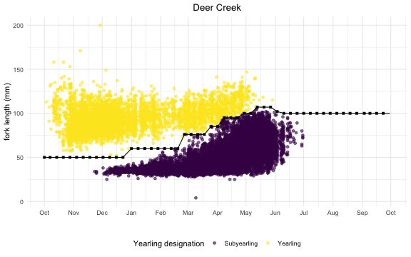

## Generate Yearling Rulesets 

Raw catch from the trap does not consistently differentiate between yearling and YOY Chinook. FlowWest presented a proposed methodology at a LHD ruleset workshop (see [lhd shiny](https://flowwest.shinyapps.io/lhd-workshop-shiny/) for workshop materials) and worked with watershed experts to define methodology to systematically determine life history for each tributary (described below).

### Approach: 

1) Set weekly cutoff values: Use visual determination on fork length over time scatter plots to set weekly cutoff values of yearlings vs YOY. 
2) Generate daily cutoff values: Use linear interpolation to extrapolate weekly cutoffs into daily values. 
3) Review & Update: Share proposed cutoff values with watershed experts to review. Update as needed. 
4) Apply cutoff to catch data: Use daily cutoff values to generate a yearling column in the catch data. 

## Set Weekly Cutoff Values & Generate daily cutoff values

FlowWest proposed weekly cutoff values and used these weekly cutoff values and generated daily values using a linear approximation function, `approxfun`. 

`generate_cutoff <- approxfun(date, fork_length_cutoff, rule = 2)`

The plot below shows the update cutoff values with linear interpolation betweek weekly cutoffs for Deer Creek. 

## Review & Update

FlowWest shared above plot for each watershed and asked stream experts to review. We incoperated in feedback on modifying rulesets to better seperate yearlings and YOY. 

## Apply cutoff to catch data

FlowWest then took daily cutoff line (shown in plot above) and used it as a threshold to classify Yearling vs YOY in historical catch data. We added an `is_yearling` column to the table and set `is_yearling = TRUE` for any fish whoes fork length exceeded the yearling cutoff on a given date. 

Applied in the weekly_data_summaries script. 
